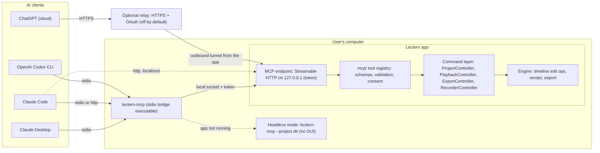
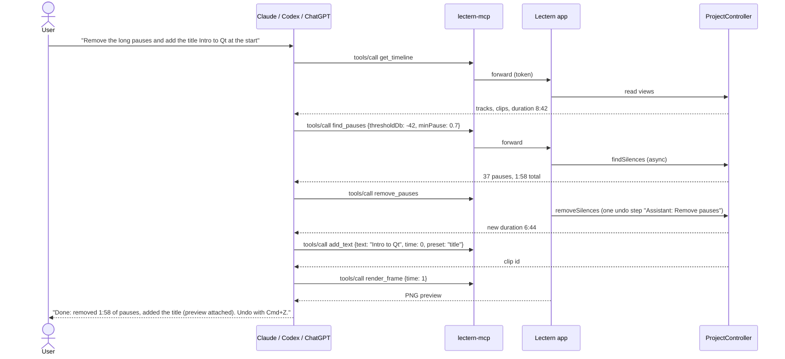
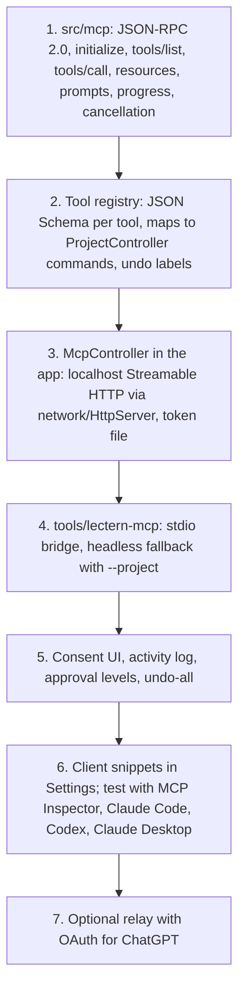

# AI Assistants — connect Claude, ChatGPT and Codex to Lectern (MCP)

Goal: let AI assistants operate Lectern — "cut the pauses, add captions, put
a title at 0:05, export a 9:16 version" — by exposing Lectern as an **MCP
server** (Model Context Protocol). One server works with every MCP client:

| Client | How it connects | Notes |
|---|---|---|
| **Claude Desktop** | Local, stdio (`lectern-mcp` started by Claude) | Config file entry, §6.1 |
| **Claude Code** (CLI, desktop, IDE) | Local, stdio or local HTTP | `claude mcp add`, §6.2 |
| **OpenAI Codex** (CLI / IDE extension) | Local, stdio | `~/.codex/config.toml`, §6.3 |
| **ChatGPT** (web/desktop, connectors / developer mode) | **Remote** HTTPS MCP endpoint | Needs a relay because ChatGPT runs in the cloud, §6.4 |
| Any other MCP client (Cursor, VS Code, Gemini CLI …) | stdio or HTTP | Same server |

Status: **design only** (2026-10-05). Client setup steps reflect how these
products worked at the time of writing and change often; verify against
each vendor's current MCP documentation before release. MCP protocol
details refer to the published specification (JSON-RPC 2.0; stdio and
Streamable HTTP transports; tools, resources, prompts).

---

## 1. Why MCP

- **One integration, every assistant.** Claude, ChatGPT, Codex and IDE agents
  all speak MCP; no per-vendor plug-in.
- **The assistant uses the same commands as the UI.** Every MCP tool calls
  the existing command layer (`ProjectController`, ~80 `Q_INVOKABLE`
  commands; `timeline::edit` operations), so assistant edits are validated,
  undoable (⌘Z) and saved like the user's own.
- **Local and private by default.** The assistant talks to the Lectern on
  the user's machine; media never leaves it unless the user exports or
  shares.
- **Works headless too.** The same tools can run on a project without the
  GUI (like `lectern-export` today) for batch jobs and CI.

---

## 2. Architecture



Terminal version:

```
 Claude Desktop ─┐
 Claude Code ────┼─ stdio ─▶ lectern-mcp ─┐ local socket + token
 Codex CLI ──────┘                        ▼
                         ┌──────────── Lectern app ────────────┐
 Claude Code ── http ──▶ │ MCP endpoint 127.0.0.1:<port>/mcp   │
                         │   ▼                                 │
 ChatGPT ─ HTTPS ─▶ relay ─ tunnel ─▶ tool registry (schemas,  │
   (optional, off)       │   consent) ▼                        │
                         │ ProjectController … (same as UI)    │
                         │   ▼                                 │
                         │ timeline edit ops · render · export │
                         └─────────────────────────────────────┘
 lectern-mcp --project <dir>  → headless engine when the app is closed
```

Components:

| Part | Where | Role |
|---|---|---|
| `src/mcp/` (Qt-free) | new module | JSON-RPC 2.0 + MCP message handling, tool/resource/prompt registry, JSON Schemas, argument validation, result formatting |
| MCP endpoint in the app | `src/ui/McpController` | Streamable HTTP server bound to `127.0.0.1` (reuses `src/network/HttpServer`), bearer token, dispatches tools to controllers on the UI thread |
| `lectern-mcp` | `tools/lectern-mcp` | Small executable that clients start. Speaks MCP over stdio; forwards to the running app (token read from a user-only file); if the app is not running, starts the headless engine for `--project` |
| Consent UI | QML | Shows connected clients, asks before sensitive actions (§5), activity log, "Undo all assistant edits" |
| Relay (optional) | Lectern cloud service | Gives ChatGPT a public HTTPS URL with OAuth; the app opens an outbound tunnel; disabled by default |

Implementation language: MCP has official SDKs for TypeScript, Python, C#,
Java, Kotlin, Go, Rust and others but not C++; the protocol is small
JSON-RPC, so `src/mcp/` implements it directly with nlohmann/json (already a
dependency) and is tested against the official **MCP Inspector** and the
conformance behaviour of the clients in §6.

---

## 3. Tools (what the assistant can do)

Every tool maps to existing or planned commands. Edits are one undo step
each, labelled "Assistant: …" in the undo history.

### 3.1 Project and timeline (read)

| Tool | Arguments | Returns | Backed by |
|---|---|---|---|
| `list_projects` | – | recent projects (title, path, duration) | home screen list |
| `open_project` | `path` | project summary | `ProjectController::open` |
| `get_timeline` | `detail?` | tracks, clips (id, start, duration, role, name), markers, layout regions | `tracks`, `markers`, `layoutRegions` views |
| `get_selection` | – | selected clips and layer | `selection`, `selectedTrack` |
| `render_frame` | `time`, `width?` | PNG image (MCP image content) | `lectern-export --frame` path |
| `get_transcript` | `from?`, `to?` | words with times | transcript module (planned) |

### 3.2 Editing

| Tool | Arguments | Backed by |
|---|---|---|
| `split_at` | `time`, `clipId?` | `splitAt` |
| `delete_clips` | `clipIds[]`, `mode` (gap / ripple) | `deleteSelected` with `linkedEditMode` |
| `remove_range` | `start`, `end` | `removeRange` |
| `trim_clip` | `clipId`, `edge`, `time` | `trimClip` |
| `move_clip` | `clipId`, `time`, `layerId?` | `moveClip`, `moveClipToTrack` |
| `find_pauses` / `remove_pauses` | `thresholdDb`, `minPause`, `padding` | `findSilences`, `removeSilences` |
| `add_marker` | `time`, `label` | `addMarker` |
| `set_layout` | `preset`, `from?` | `setLayoutPreset`, `setLayoutFrom` |
| `add_layer` / `rename_layer` / `move_layer` / `delete_layer` | … | `addTrack`, `renameTrack`, `moveTrack`, `deleteTrack` |
| `undo` / `redo` | `steps?` | `undo`, `redo` |

### 3.3 Text, captions, look, audio

| Tool | Arguments | Backed by |
|---|---|---|
| `add_text` | `text`, `time`, `duration`, `preset`, `style?` | `addText`, `setTextValue` |
| `add_captions` | `language?`, `style?` | transcription (planned) → subtitle track |
| `import_subtitles` / `export_subtitles` | `path` | `importSubtitles`, `exportSubtitles` |
| `set_color` | `clipId` or `role`, values (exposure, contrast, saturation, temperature, tint, wheels) | `setColorValues`, `setColorWheel`, `applyToRole` |
| `apply_lut` | `clipId`, `lut`, `amount` | `setColorLut` |
| `list_looks` / `apply_look` | `clipIds`, `look` (oppenheimer, dark-green, teal-orange …, or "none"), `amount` | `looks`, `applyLook` — a look on top of the clip's correction |
| `set_hsl_curve` | `clipId`, `nodeId?`, `curve` (hueVsHue, hueVsSat, hueVsLum, lumVsSat, satVsSat, satVsLum), `points` | `setHslCurve`, `setNodeHslCurve` — e.g. calm the greens |
| `copy_grade` | `fromClipId`, `toClipIds` | `copyGradeTo` (the user's copied grade is untouched) |
| `add_node` | `clipId`, `select` (whole, person, background, circle, rectangle, gradient, color), `window?`, `qualifier?`, `pick? {x, y, time}`, `grade?`, `invert?` → `nodeId` | `addNode`, `setNodeWindow`, `setNodeQualifier`, `pickNodeColor`, `setNodeValue` — grade only part of the picture |
| `set_node` / `remove_node` | `clipId`, `nodeId`, any of the above, `enabled`, `label` | node setters, `removeNode` |
| `set_effect` | `clipId`, `type` (blur, vignette, zoom, background-blur, film-grain, glow, halation, film-emulation), `params` | `setEffectEnabled`, `setEffectValue` |
| `set_style` | key/value (padding, radius, camera shape …) | `setStyleValue` |
| `set_audio` | `clipId` or `trackId`, gain/mute/fades | `setClipAudio`, `setTrackValue` |
| `clean_voice` | `clipId?` | voice cleanup (planned, FULL_GAP_AUDIT §3.23) |
| `add_music` | `path`, `time` | `importMedia(..., "music")` |

### 3.4 Export and recording

| Tool | Arguments | Notes |
|---|---|---|
| `export_video` | `path`, `preset` (youtube, shorts-9x16, …), `range?` | Long-running: returns a job id; progress via MCP progress notifications; `get_job` / `cancel_job` |
| `start_recording` / `stop_recording` | sources, countdown | **Always needs on-screen confirmation in Lectern** (§5) |

### 3.5 Resources and prompts

| Kind | URI / name | Content |
|---|---|---|
| Resource | `lectern://project/current` | project summary (JSON) |
| Resource | `lectern://project/timeline` | full timeline view (JSON) |
| Resource | `lectern://project/transcript` | transcript (text + timings) |
| Resource | `lectern://frame/{seconds}` | PNG frame |
| Resource | `lectern://docs/shortcuts` | SHORTCUTS.md (helps the assistant explain the UI) |
| Prompt | `clean_up_recording` | remove pauses + filler words, clean voice, add captions |
| Prompt | `make_short` | pick the best 30–60 s, reframe 9:16, captions, export |
| Prompt | `add_chapters` | chapters and markers from the transcript |

Tool annotations (MCP `readOnlyHint`, `destructiveHint`, `idempotentHint`)
are set on every tool so clients can auto-approve read-only tools and ask
for edits.

---

## 4. Example: "remove the pauses and add a title"



---

## 5. Safety, consent and privacy

| Rule | Detail |
|---|---|
| Off until enabled | Settings → AI assistants → "Allow assistants to control Lectern" (per client) |
| Local only by default | HTTP endpoint binds to `127.0.0.1`; random port written to a user-only file with a random bearer token; stdio bridge reads it |
| Approval levels | *Read only* · *Edit (undoable)* · *Full (export, import files, recording)*; chosen per client |
| Always confirm in Lectern | starting a recording, overwriting files outside the project, deleting layers with clips, sharing/uploading |
| Undoable | each tool call is one labelled undo step; "Undo all assistant edits since …" button |
| Visible | top-bar chip "Claude is editing…" with an activity log of every call |
| File access | paths limited to the project folder and folders the user approved; no arbitrary file reads |
| Media privacy | frames and transcripts are only returned when a tool asks for them; the client then sends them to its model provider — shown in the consent text |
| Remote (ChatGPT) | relay off by default; OAuth sign-in; per-session approval in the app; relay never stores media |
| Rate limits | long jobs queued; one export at a time |

---

## 6. Client setup

The paths below assume the macOS app bundle; on Windows use
`C:\Program Files\Lectern\lectern-mcp.exe`. Lectern's Settings page will show
these snippets with the correct paths and a "Copy" button.

### 6.1 Claude Desktop

`claude_desktop_config.json` (Claude → Settings → Developer → Edit Config):

```json
{
  "mcpServers": {
    "lectern": {
      "command": "/Applications/Lectern.app/Contents/MacOS/lectern-mcp",
      "args": []
    }
  }
}
```

Restart Claude Desktop; Lectern's tools appear in the tools menu.
(A one-click desktop extension package can replace manual config later.)

### 6.2 Claude Code

```bash
# stdio (recommended)
claude mcp add lectern -- /Applications/Lectern.app/Contents/MacOS/lectern-mcp

# or the app's local HTTP endpoint (port and token shown in Lectern's settings)
claude mcp add --transport http lectern http://127.0.0.1:<port>/mcp \
  --header "Authorization: Bearer <token>"
```

Check with `claude mcp list`, or `/mcp` inside a session. A project-scoped
`.mcp.json` can be committed to share the setup with a team.

### 6.3 OpenAI Codex (CLI / IDE extension)

`~/.codex/config.toml`:

```toml
[mcp_servers.lectern]
command = "/Applications/Lectern.app/Contents/MacOS/lectern-mcp"
args = []
```

(Newer Codex versions also offer `codex mcp add`; check `codex mcp --help`.)

### 6.4 ChatGPT

ChatGPT runs in the cloud, so it can only reach a **public HTTPS** MCP
server. Two options:

1. **Lectern relay (planned):** Settings → AI assistants → ChatGPT → "Create
   connection" gives a URL like `https://mcp.<lectern-domain>/u/<id>`; in
   ChatGPT add it as a custom connector (developer mode / connectors
   settings), sign in with OAuth, and approve the session in Lectern.
2. **Self-hosted tunnel** for developers: expose the local endpoint through
   a tunnel (e.g. Cloudflare Tunnel) with authentication. Not recommended
   for normal users.

Availability of custom connectors depends on the ChatGPT plan and settings
at the time; verify in OpenAI's documentation.

### 6.5 Testing with MCP Inspector

```bash
npx @modelcontextprotocol/inspector /Applications/Lectern.app/Contents/MacOS/lectern-mcp
```

Lists the tools, calls them by hand, and shows raw JSON-RPC — used in
development and in the release checklist.

---

## 7. Lectern as an MCP client (later)

The reverse direction: an in-app assistant panel ("Ask Lectern") that uses a
model provider the user chooses (Anthropic Claude API, OpenAI API, or a local
model) and can call **other** MCP servers the user connects (stock media
library, Google Drive, Notion scripts …). It would use the same tool
registry internally. Out of scope until the server side ships; listed in
FULL_GAP_AUDIT §7 as AI features.

---

## 8. How to build it



| Step | Files | Tests |
|---|---|---|
| 1 | `src/mcp/JsonRpc.*`, `src/mcp/Server.*` | unit: message parsing, errors, batching rules, cancellation |
| 2 | `src/mcp/Tools.*` (schemas), `src/ui/McpTools.cpp` (bindings) | controller tests per tool (same pattern as `tests/ui/ControllerTest.cpp`); schema validation rejects bad input |
| 3 | `src/ui/McpController.*` | integration: HTTP call to localhost changes the timeline; wrong token refused |
| 4 | `tools/lectern-mcp/main.cpp` | spawn the bridge in a test, run `initialize` + `tools/list` + `get_timeline` over stdio |
| 5 | QML settings page + top-bar chip | QML interaction tests (`tests/qml/`) |
| 6 | docs + snippets | manual checklist with each client; MCP Inspector run in CI |
| 7 | relay service (separate repo) | security review, OAuth flow tests |

Done when: from Claude Code, Codex and Claude Desktop, a user can ask "remove
the pauses, add captions and export for YouTube" on a real recording; every
change is undoable in the app; nothing runs without the user having enabled
the client.
