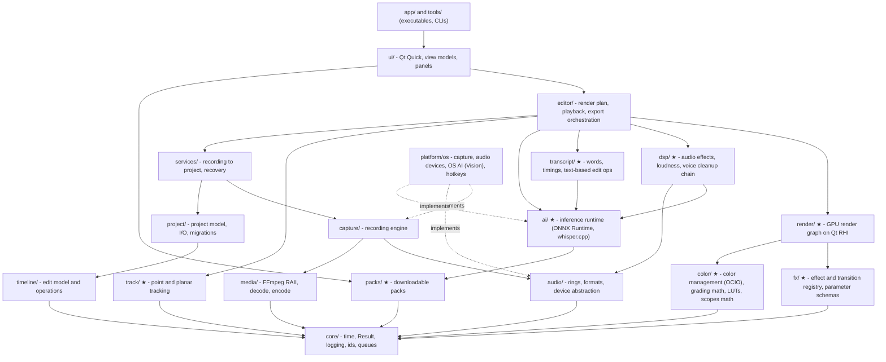
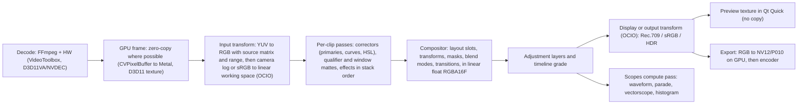
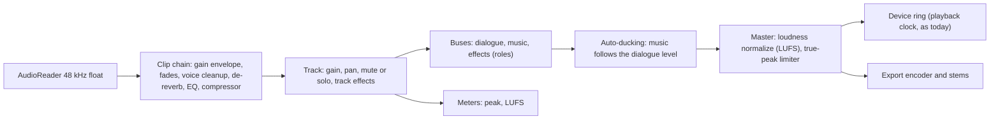
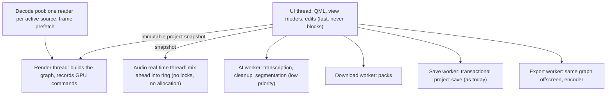
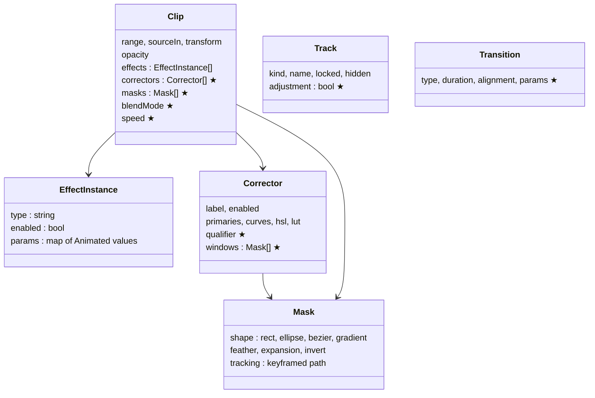
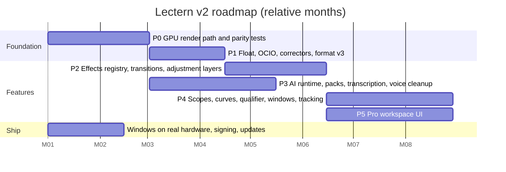
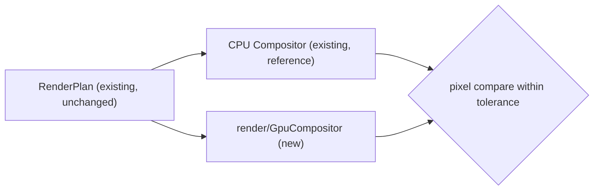
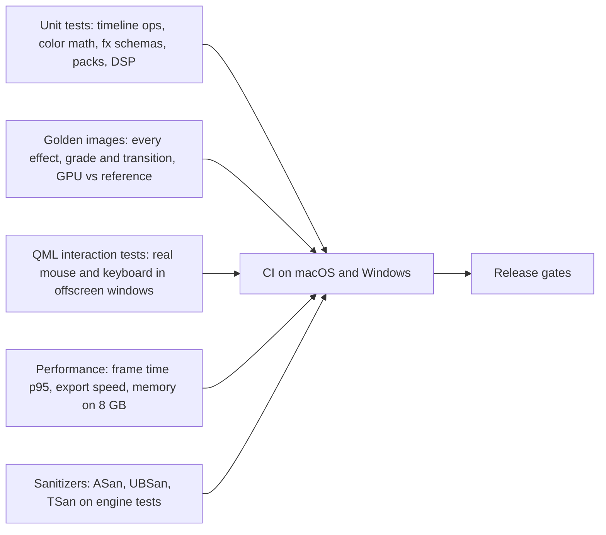

# Lectern v2 Architecture — tech choices and how to build it

How the architecture grows from today's editor to the pro editor described
in the v2 checklists (COLOR_EFFECTS_PARITY, PRO_INTERFACE_PARITY,
DAVINCI_COLOR_PAGE, FULL_GAP_AUDIT). It covers the target module map, the
frame and audio pipelines, threads, the libraries to use, and the
implementation phases with their tests.

Status: **design only** (2026-10-05). The current architecture is in
../ARCHITECTURE.md and ../RENDERING_PIPELINE.md §0; everything in those
documents stays valid unless this one says otherwise. Library versions and
licences must be re-checked before each is adopted.

---

## 1. Goals and constraints

| Goal | Measure |
|---|---|
| Real-time preview | 1080p30 timeline with a grade, two effects and a transition plays without drops on an M1 MacBook Air 8 GB |
| Export speed | ≥ 2× real time for 1080p30 with grading (today ≈ 2× without) |
| Quality | Float (16-bit half or 32-bit) linear-light processing, color managed; preview and export identical (same pipeline) |
| Platforms | macOS (Apple Silicon first) and Windows 10/11; Linux later |
| Engine stays Qt-free | `core, media, audio, capture, timeline, project, services` and the new engine modules below (except `render/` and `ui/`) build without Qt, so the CLI, tests and a future export worker reuse them |
| Licence-clean | Commercial distribution possible: only BSD/MIT/Apache/LGPL-dynamic dependencies; codecs through OS encoders or an LGPL FFmpeg build |
| Small install | ~150–250 MB; large assets as packs (FEATURE_DELIVERY.md) |
| Never lose work | Every edit undoable; autosave; crash recovery (as today) |

---

## 2. Module map (v2)

New modules are marked ★.



Terminal version:

```
 app/ tools/
    │
   ui/ ─────────────────────────────── packs/★
    │                                     ▲
 editor/ ──┬── render/★ ──┬── fx/★        │
           │              └── color/★     │
           ├── dsp/★ ─────────────┐       │
           ├── transcript/★ ── ai/★ ──────┘
           ├── track/★
           └── services/ ── capture/ ── audio/ ── media/
                        └── project/ ── timeline/
                                   all ── core/
 platform/<os> implements capture, audio, ai (Vision/CoreML, DirectML)
```

Rules (enforced with CMake target dependencies, as today):
- `render/` is the only module besides `ui/` that links Qt GUI's RHI; it
  takes a `RenderPlan` (pure data, `editor/RenderPlan.h`) and produces
  textures/images. It has no project or timeline knowledge.
- `fx/`, `color/`, `track/`, `dsp/`, `transcript/`, `packs/` are Qt-free.
  `fx/` describes effects (id, parameters, ranges, defaults, shader name);
  `render/` owns the shaders.
- `ai/` hides the inference library behind `ai::Model` /
  `ai::Session`; features never include ONNX Runtime or whisper.cpp headers.
- `editor/` keeps the CPU compositor during migration as the reference
  implementation for pixel tests, then as a fallback.

---

## 3. Frame pipeline (GPU)



Key decisions:
- **One render graph per frame**, built from the `RenderPlan`. Each node is
  a render pass (fragment shader) or compute pass; intermediate textures
  come from a pool keyed by size and format, so steady-state playback
  allocates nothing.
- **Working format:** RGBA16F linear (half float) for preview; RGBA32F
  optional for export when quality mode is "Maximum".
- **Effects** are fragment shaders with a uniform block generated from the
  `fx/` parameter schema; animated parameters are evaluated on the CPU per
  frame (the timeline's `Animated<T>` keyframes) and passed as uniforms.
- **Masks/qualifiers** produce single-channel matte textures that the next
  pass reads; tracking data moves window shapes per frame.
- **Preview resolution**: full / half / quarter, and adaptive while
  scrubbing (PRO_INTERFACE §3.3, §3.12).
- **Fallback**: if the GPU path fails (driver issue), the CPU compositor
  renders with reduced features and a visible notice.

## 4. Audio pipeline



- Heavy AI cleanup (voice isolation, de-reverb) is **pre-rendered** in the
  background into a cached cleaned file per clip, so playback stays real
  time on 8 GB machines; light DSP (EQ, compressor, limiter, gain) runs
  live.
- The existing lock-free ring and the device-as-master-clock design stay.

## 5. Threads



The immutable-snapshot model of today's `ProjectController` / `PlaybackEngine`
is kept: every edit produces a new `shared_ptr<const Project>`; render and
audio threads pick it up without locks on the document.

---

## 6. Data model changes



- **Project format v3**: today's single `ColorAdjustments` per clip
  (`timeline/Timeline.h`) becomes the first `Corrector`; v2 → v3 migration
  is automatic and tested (as the v1 → v2 migration is today).
- Transitions live between adjacent clips on a track (edit ops in
  `timeline::edit` keep them valid across split/trim/ripple).
- Timeline-level grade: a `Corrector[]` on the timeline.
- Packs used by a project: `packs` map (FEATURE_DELIVERY.md §7).

---

## 7. Best tools and technology

| Area | Choice | Why | Rejected | Licence |
|---|---|---|---|---|
| GPU API | **Qt RHI** (Metal, D3D11/12, Vulkan) | Same API on every OS; textures shared with Qt Quick with no copy; already the UI's renderer | Raw Metal + D3D (two engines); bgfx/WebGPU (texture sharing with Qt is hard) | Qt (LGPL/commercial). RHI has had limited compatibility guarantees — pin the Qt version |
| Shaders | GLSL 450 compiled at build time with **qsb** (Qt Shader Tools) to SPIR-V, MSL, HLSL | Write once; no runtime compiler | Hand-written per API | Build-time tool; check Qt Shader Tools licence for the edition used |
| Color management | **OpenColorIO 2** with ACES/studio configs | Industry standard; GPU shader generation for transforms | Own transforms only (error-prone) | BSD-3 |
| Grading math | Own (primaries, curves, HSL, wheels) in shaders, matched to Resolve/Lumetri ranges | Full control, real time | – | – |
| LUTs | Existing `.cube` parser (`editor/ColorGrading`) → 3D texture | Already tested | – | – |
| Effects | Own registry (`fx/`): JSON parameter schema + shader | Small, fast, testable | OpenFX host now (big, later as P3) | – |
| AI runtime | **ONNX Runtime** with CoreML (macOS) and DirectML (Windows) execution providers | One model format; uses Neural Engine/GPU | TensorFlow Lite, LibTorch (large) | MIT |
| OS AI | Apple **Vision** (person segmentation, already used); Windows ML where useful | Free, fast, no download | – | OS |
| Transcription | **whisper.cpp** (Metal/CoreML on macOS; CPU/GPU on Windows), models as packs | Local, accurate, many languages, word timings | Cloud APIs (privacy, cost), Vosk (lower accuracy) | MIT (code and models) |
| Voice cleanup | **DeepFilterNet** (via ONNX) for noise; **RNNoise** as a tiny fallback | Good quality, real-time capable, permissive | Proprietary SDKs | MIT/Apache-2; BSD-3 |
| Loudness | **libebur128** | EBU R128 / LUFS standard | Own (risk) | MIT |
| Audio DSP | Own biquad EQ, compressor, limiter, gate, de-esser | Simple, real-time safe | JUCE (licence), large frameworks | – |
| Resampling | FFmpeg swresample (today); **r8brain** if higher quality needed | Already present | – | LGPL; MIT |
| Tracking | **OpenCV 4** trackers (KLT, CSRT) + own planar tracker on top | Proven, permissive | Mocha SDK (commercial) | Apache-2 |
| Text | Qt text layout (HarfBuzz inside Qt) | Shaping, RTL, emoji | FreeType/HarfBuzz directly | Qt |
| Lottie stickers | **rlottie** | Small, fast | Qt Lottie module (licence) | MIT (verify bundled parts) |
| Packs / downloads | QNetworkAccessManager; Ed25519 + SHA-256 via **OpenSSL** (already a dependency) | No new dependency | libcurl | Apache-2 |
| Updates | **Sparkle 2** (macOS), **WinSparkle** (Windows) | Standard, signed updates | Own updater | MIT |
| Crash reports | **Crashpad** (opt-in), self-hosted or Sentry | Minidumps on all OSes | – | Apache-2 |
| Packaging | macdeployqt + codesign + notarytool (DMG); windeployqt + MSIX or Inno Setup | Standard toolchains | – | – |
| Tests | GoogleTest + CTest; QML harness (`tests/qml/QmlHarness.h`); golden images | Already in place | – | BSD-3 |

Codec licensing: encode H.264/HEVC through the OS encoders
(VideoToolbox, Media Foundation) and an LGPL, dynamically linked FFmpeg
without GPL parts (see ../ARCHITECTURE.md §11). ProRes encoding on macOS via
VideoToolbox.

---

## 8. How to implement — phases



(The dates are placeholders to show order and overlap; month 1 = start.)

### Phase 0 — GPU render path (COLOR §1.1, §1.15)



- Build `render/` with a texture pool, a pass system and shaders for what
  the CPU compositor does today: layers with layout slots, rounded corners,
  shadows, borders, circle camera, text (rendered to texture), blur,
  vignette, zoom, color (current curves + LUT).
- Same `RenderPlan` input; switch with a setting/flag.
- **Tests:** golden-image comparison of GPU vs CPU for every RenderPlan test
  case (`tests/editor/CompositorTest.cpp` cases reused), tolerance a few
  code values; benchmark: 1080p30 preview, frame time p95 < 12 ms on M1.
- **Done when:** preview and export use the GPU path by default; CPU path
  stays as fallback.

### Phase 1 — Float and color management (COLOR §1.2–1.7, §5.1, §5.11)
- RGBA16F linear working space; OCIO config shipped in the app;
  per-clip input color space (auto from metadata: Rec.709, sRGB, HLG, PQ,
  camera logs).
- `Corrector[]` per clip + timeline grade; project format v3 with migration.
- **Tests:** OCIO transform round-trips; migration tests (v2 project →
  v3 renders identically); 10-bit gradient shows no banding (measured).

### Phase 2 — Effects, transitions, adjustment layers (COLOR §9–15)
- `fx/` registry; Effect Controls panel generated from schemas; first 30
  effects (blur family, sharpen, glow, grain, mosaic, crop, rotate, flip,
  drop shadow, chroma key, blend modes); transitions (dissolve, dips, push,
  wipe, zoom, layout transitions).
- Edit ops for transitions in `timeline::edit` with the same "succeed fully
  or change nothing" rule.
- **Tests:** per-effect golden images; edit-op tests; QML tests for
  applying and keyframing an effect.

### Phase 3 — AI and packs (AUDIT §3.6, §3.23, §6.3, §2.18; FEATURE_DELIVERY)
- `packs/` + downloader; `ai/` with ONNX Runtime and whisper.cpp;
  transcription → captions → text-based editing (`transcript/` edit ops
  map word deletions to `removeRanges`, which exists today); voice cleanup
  pre-render cache.
- **Tests:** transcription on a known audio clip (word timings within
  ±100 ms); cleanup SNR improvement on a synthetic noisy file; pack
  verifier tests; end-to-end download from the local test HTTP server.

### Phase 4 — Grading tools and tracking (DAVINCI §5–7, COLOR §3–6)
- Primaries palette identical to Resolve's ranges, curves, HSL qualifier
  with matte view, windows with feather, point/planar tracker, scopes as
  compute passes.
- **Tests:** chart-based grading tests (known input → expected values);
  tracker accuracy on a synthetic moving target; scope histograms checked
  against CPU computation.

### Phase 5 — Pro workspace UI (PRO_INTERFACE U0–U1)
- Docking panel system, tools bar, Effect Controls with scrubby fields and
  stopwatches, keyframes in the timeline, menus, command palette, keymap
  presets (SHORTCUTS.md part B).
- **Tests:** QML interaction tests for every gesture, as for the timeline
  today (`tests/qml/TimelineInteractionTest.cpp`).

### Ship track (in parallel)
- Windows: run, profile and fix on real hardware (FULL_GAP_AUDIT §11.2).
- Signing/notarization, installers, auto-update, opt-in crash reports,
  codec licence review (FULL_GAP_AUDIT §18).

---

## 9. Testing strategy



- Golden images are stored small (PNG, 480p) with a per-test tolerance;
  GPU drivers differ slightly, so comparisons use max and mean error, not
  exact bytes.
- Performance tests run on a fixed project (10 minutes 1080p, grade +
  2 effects + transitions) and fail the build on regressions > 10 %.

## 10. Risks and decisions

| Risk | Mitigation |
|---|---|
| Qt RHI API changes between Qt versions | Pin Qt; isolate RHI use in `render/`; keep CPU fallback |
| 8 GB machines run out of memory with float textures and AI models | Texture pool limits; half-float; AI pre-render in background; models as packs; unload when idle |
| GPU driver differences on Windows | Golden-image tolerances; driver blocklist → CPU fallback; test on Intel/AMD/NVIDIA |
| Scope creep (736 checklist items) | Priorities P0–P3 from FULL_GAP_AUDIT §14; each phase has a "done when" |
| Licence problems | Only permissive dependencies listed in §7; review before each release |
| AI quality varies by language/accent | Model choice per pack; user can pick accurate vs fast |

Decisions recorded here:
1. Hybrid delivery — built-in engine and effects, AI models and content as packs (FEATURE_DELIVERY.md).
2. GPU pipeline on Qt RHI with the existing `RenderPlan` as input.
3. OCIO for color management; own grading math.
4. ONNX Runtime + whisper.cpp for local AI; no cloud dependency by default.
5. Project format v3 for correctors, masks, transitions, adjustment layers.
