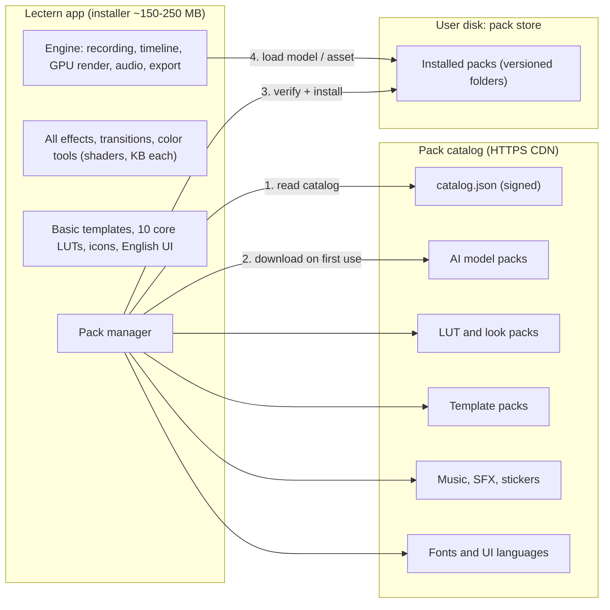
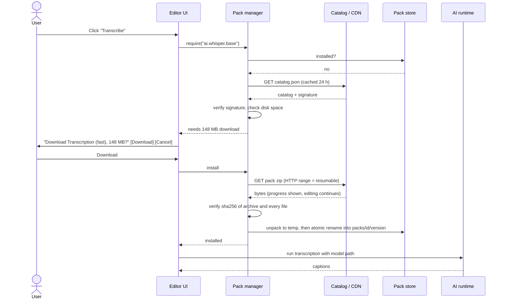
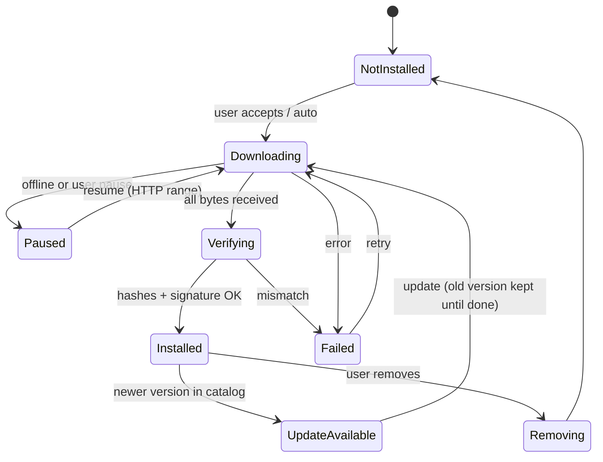
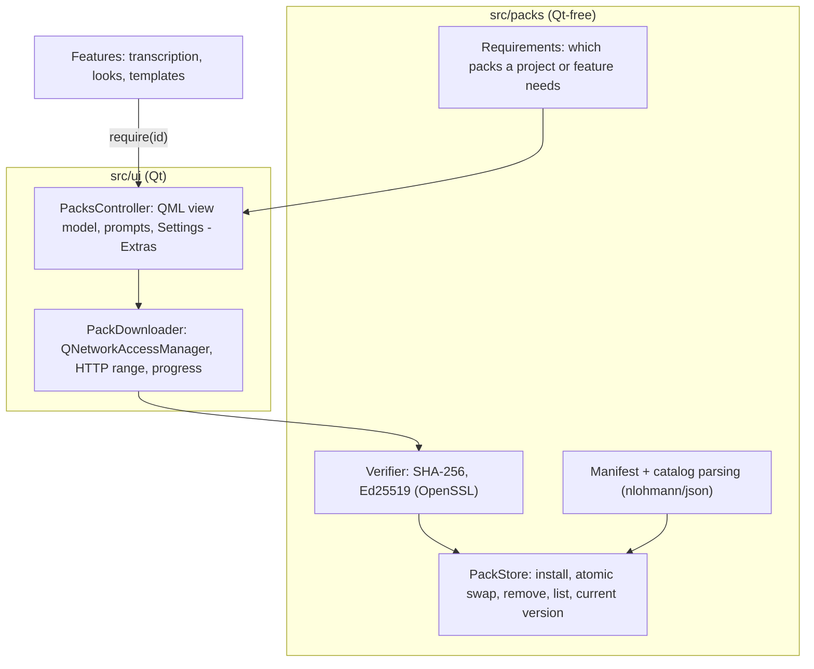

# Feature Delivery — built in, or downloaded one by one?

Question (2026-10-05): should Lectern ship every feature in the installer,
or let users download features one by one? This document gives the answer,
the diagrams, and how to build it.

Status: **design only**. Nothing here is implemented yet. Sizes of
third-party models are approximate and must be re-checked when each pack is
built.

---

## 1. Decision: hybrid — engine built in, heavy assets as packs

| | All built in | Everything downloaded one by one | **Hybrid (chosen)** |
|---|---|---|---|
| Installer size | Several GB (AI models, libraries of looks/music) | Tiny | **~150–250 MB** |
| Works offline after install | Yes | Only what was downloaded | **Yes for all editing; AI/assets once downloaded** |
| Opening someone else's project | Always works | Breaks if they used a feature you lack | **Always opens; effects are built in; only optional assets may be missing, with one-click install** |
| Disk use on small laptops | Wastes GBs | Minimal | **Pay only for what you use** |
| Update speed | Every update is huge | Small | **Small app updates; packs update on their own** |
| Engineering cost | Lowest | Highest (every effect is a module) | **Medium (one pack system for data, not code)** |
| User confusion | None | High ("why is blur missing?") | **Low — only big, clearly optional things ask to download** |

**Rule:** if it is *code* or *small* (shaders, effects, transitions, color
tools, UI, icons, basic templates, a few LUTs), it is **built in**. If it is
*large data* or *optional content* (AI models, language models, look/LUT
libraries, template and stock libraries, extra fonts, UI languages), it is a
**pack** downloaded on first use.

Packs never contain executable code — only models, images, audio, LUTs,
fonts, templates (JSON + media) and translations. This keeps them safe and
lets one installer serve every user.

---

## 2. Overview diagram



Same picture for terminals:

```
┌──────────── Lectern app (built in) ────────────┐        ┌──── Pack catalog (CDN) ────┐
│ Engine: record · timeline · GPU render · audio │        │ catalog.json (signed)      │
│ All effects / transitions / color tools        │ ─────▶ │ AI models (Whisper, voice, │
│ Basic templates · core LUTs · icons · English  │  first │   segmentation, upscale)   │
│ Pack manager ───────────────────────────────── │  use   │ LUT/look · templates ·     │
└───────────────────────┬────────────────────────┘        │ stock · fonts · languages  │
                        │ verify hash + signature          └────────────────────────────┘
                        ▼
              ┌──── Pack store on disk ────┐
              │ packs/<id>/<version>/…     │ ◀── engine loads models/assets
              └────────────────────────────┘
```

---

## 3. What goes where (size budget)

| Feature | Size (approx.) | Delivery | Checklist |
|---|---|---|---|
| Engine, UI, all effects/transitions/color shaders | 120–200 MB incl. Qt + FFmpeg | Built in | all |
| Core LUTs (camera log → Rec.709, 6–10 looks) | < 5 MB | Built in | COLOR §7 |
| Basic text/title/caption templates | < 10 MB | Built in | AUDIT §4.6 |
| Person segmentation (macOS uses the OS — 0 MB) | 0 MB macOS · 5–30 MB Windows model | Built in on macOS; pack on Windows | COLOR §4.9 |
| Voice cleanup / noise removal model | 5–30 MB | **Built in** (core to a recorder; small) | AUDIT §3.6, §3.23 |
| Transcription — small / fast model | ~75–150 MB | **Pack** (offered at first "Transcribe") | AUDIT §6.3 |
| Transcription — accurate model | ~0.5–3 GB | **Pack** (optional upgrade) | AUDIT §6.3 |
| Language packs for transcription (if per-language models are used) | 50–500 MB each | Pack | AUDIT §6.8 |
| AI upscale / frame interpolation | 50–300 MB | Pack | COLOR §18.8, §18.10 |
| Object removal / generative models | 0.5–2 GB | Pack (later) | COLOR §8.7 |
| Film looks / LUT libraries | 20–200 MB per pack | Pack | COLOR §7.6 |
| Template packs (lower thirds, intros, YouTube elements) | 20–300 MB per pack | Pack | AUDIT §4.6, §4.18 |
| Stock music, SFX, stickers | 100 MB–2 GB | Pack, or stream-and-cache per item | AUDIT §4.17 |
| Extra fonts | 5–100 MB per pack | Pack | INTERFACE §8.2 |
| UI languages | 1–5 MB each | Pack (or built in when small) | AUDIT §9.8 |

---

## 4. Pack format

```
packs/
  ai.whisper.base/            ← pack id
    1.2.0/                    ← version (several may coexist during update)
      pack.json
      model.bin
    current -> 1.2.0          ← pointer file (not a symlink on Windows)
```

`pack.json`:

```json
{
  "id": "ai.whisper.base",
  "version": "1.2.0",
  "kind": "ai-model",
  "title": "Transcription (fast)",
  "description": "Speech to text, 99 languages, good accuracy",
  "license": "MIT",
  "minAppVersion": "2.0.0",
  "platforms": ["macos-arm64", "macos-x64", "windows-x64"],
  "dependencies": [],
  "files": [
    { "path": "model.bin", "size": 147951465, "sha256": "…" }
  ]
}
```

`catalog.json` (served from the CDN, signed with Ed25519; the public key is
compiled into the app):

```json
{
  "schema": 1,
  "generated": "2026-10-05T00:00:00Z",
  "packs": [
    { "id": "ai.whisper.base", "version": "1.2.0", "size": 147951465,
      "url": "https://packs.example.com/ai.whisper.base/1.2.0.zip",
      "sha256": "…", "manifestSha256": "…" }
  ],
  "signature": "base64-ed25519-over-everything-above"
}
```

Pack kinds: `ai-model`, `lut-library`, `templates`, `stock-audio`,
`stickers`, `fonts`, `ui-language`.

---

## 5. Install flow (first use)



## 6. Pack states



---

## 7. Projects and missing packs

- A project records the packs it uses: `"packs": {"looks.cinematic": "1.0.0"}`
  (only content packs — effects are built in and never missing).
- Opening a project with a missing pack: the project opens normally, the
  timeline shows the clip with a small "needs Cinematic Looks — Install"
  badge, the preview renders without that asset (e.g. LUT skipped), and one
  click installs it. Nothing is ever deleted from the project.
- Export warns if a pack is missing, and offers to install or export anyway.
- "Collect project" (AUDIT §1.6) copies used pack assets into the project
  folder so it can move to an offline machine.

## 8. Storage, disk space, updates, offline

| Topic | Rule |
|---|---|
| Location | macOS `~/Library/Application Support/Lectern/packs`; Windows `%LOCALAPPDATA%\Lectern\packs`; user can move it (Settings) |
| Disk check | Need size × 2 free (archive + unpack) before starting; clear message otherwise |
| Manage | Settings → Extras: list packs, size, version, update, remove, "remove unused" |
| Updates | Catalog checked at most once a day; packs update in background on Wi-Fi only if the user allows; old version kept until the new one verifies |
| Offline / company use | "Install pack from file…" accepts the same zip (signature still checked); catalog mirror URL configurable |
| Bandwidth | Resumable downloads, one at a time by default, pause/resume, metered-network aware |

## 9. Security

- HTTPS only; certificate validation via Qt's TLS backend.
- `catalog.json` signed with Ed25519 (OpenSSL, already a dependency); the
  public key is built into the app; key rotation by shipping a second key in
  an app update.
- Every archive and every file has a SHA-256 in the signed catalog/manifest.
- Packs hold data only; no executables, scripts or plug-ins. Paths are
  validated (no `..`, no absolute paths) before unpacking.
- No personal data is sent; the catalog request carries only app version and
  platform.

---

## 10. How to build it



Steps:
1. `src/packs/` library (Qt-free): `PackManifest`, `Catalog`, `Verifier`,
   `PackStore`, with unit tests (bad hash, bad signature, path traversal,
   interrupted install, two versions side by side).
2. `PackDownloader` + `PacksController` in `src/ui/`, QML "Download?" dialog,
   progress chip in the top bar, Settings → Extras page.
3. Project format: optional `packs` map; missing-pack badge in the timeline.
4. First real pack: transcription model (with the transcription feature,
   AUDIT §6.3). Then look packs, then templates.
5. CI job that builds packs, computes hashes, signs the catalog and uploads
   to the CDN (private key only in CI secrets).

Tests: unit (store/verifier), a local HTTP test server (the project already
has `src/network/HttpServer`) serving a signed test catalog for end-to-end
download tests, QML tests for the prompt and Settings page.
