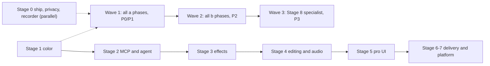

# Master Phase Plan — every feature, phase by phase

Every open item from the v2 checklists (COLOR_EFFECTS_PARITY,
PRO_INTERFACE_PARITY, DAVINCI_COLOR_PAGE, FULL_GAP_AUDIT) placed into one
small phase. Generated 2026-10-05 from those documents by `scripts/` in this folder
(`python3 scripts/build_master_plan.py`), so
**each of the 636 open items (⬜ missing or 🟡 partly done) appears exactly
once**; the 100 done items (✅) are listed in the appendix.

How it is organised:
- **Stages 0–8** follow the order of work: ship basics in parallel; color
  first (ROADMAP Phase 1); deep MCP and the AI editor second (ROADMAP
  Phase 2); then effects, editing/audio, pro UI, delivery, platform;
  specialist work last.
- Each phase has an **a** part (must-have, P0/P1) and a **b** part (power
  users, P2). Build all **a** phases first, then the **b** phases. Stage 8
  holds every P3 item.
- Large phases are cut into sub-phases (e.g. 1.4a.1, 1.4a.2) by topic.
- The same feature can appear in several checklists (e.g. auto reframe in
  COLOR, AUDIT and the AI list); such rows sit in the same phase — build it
  once and tick every row.
- Phase numbers in Stages 1–2 match ROADMAP_PHASES.md. Phases marked
  "new work" have no checklist rows (MCP, edit plans, self-review, …).
- Ref column: COLOR = COLOR_EFFECTS_PARITY §, UI = PRO_INTERFACE_PARITY §,
  DAVINCI = DAVINCI_COLOR_PAGE §, AUDIT = FULL_GAP_AUDIT §.
- Same rules for every phase: usable when merged, MCP tool + test, golden
  images / QML tests where relevant, undoable, meets the M1 8 GB budget,
  and the checklist rows are updated (⬜ → 🟡 → ✅).

## Order of work

Stage 2 starts as soon as phase 1.3 is done (project format stable) and
then runs beside Stage 1.

## Claude token estimate

Rough budget for building each phase with Claude Code (implement, compile, test, fix), counted as **tokens processed**: input (mostly the same project context re-read on every step, which providers bill at a much lower cached rate) plus output. Output tokens are about 5 % of the total.

Model: P0 item ≈ 0.6M, P1 ≈ 0.5M, P2 ≈ 0.4M, P3 ≈ 0.8M (specialist work is harder); the **a** part of a Stage 1–2 phase is at least its ROADMAP_PHASES size (S ≈ 2.5M, M ≈ 5M, L ≈ 12M), because foundation work is large even with few checklist rows; "new work" phases by size. Treat every number as ×0.5–×2: it depends on how much code a feature touches, how many test/fix rounds it needs, and the model used. Re-measure after the first phases and update `PER_ITEM` in `scripts/render_plan.py`.

| Stage | Tokens processed (est.) | Output tokens (≈ 5 %) |
|---|---|---|
| Stage 0 — Ship, privacy and recorder (parallel track) | ~16M | ~0.8M |
| Stage 1 — Color grading like DaVinci (ROADMAP Phase 1) | ~88M | ~4.4M |
| Stage 2 — Deep MCP and the pro-editor agent (ROADMAP Phase 2) | ~61M | ~3.1M |
| Stage 3 — Effects, compositing, animation, text | ~46M | ~2.3M |
| Stage 4 — Editing, audio, captions | ~20M | ~1.0M |
| Stage 5 — Pro workspace UI | ~56M | ~2.8M |
| Stage 6 — Delivery and collaboration | ~9.8M | ~0.5M |
| Stage 7 — Project, performance, platform | ~7.2M | ~0.4M |
| Stage 8 — Specialist (P3, on demand) | ~105M | ~5.2M |
| **All stages** | **~409M** (≈ 205M–819M) | **~20M** |

Wave 1 only (all **a** phases + new-work phases): ~228M tokens processed.

## All phases (table of contents)

**Stage 0 — Ship, privacy and recorder (parallel track)**

- **0.1a** Ship the product · must-have (P0/P1) · 8 items · ~4.5M tokens
- **0.1b** Ship the product · power users (P2) · 2 items · ~0.8M tokens
- **0.2a** Privacy and redaction · must-have (P0/P1) · 6 items · ~3.2M tokens
- **0.3a** Recorder must-haves · must-have (P0/P1) · 11 items · ~5.8M tokens
- **0.3b** Recorder must-haves · power users (P2) · 4 items · ~1.6M tokens

**Stage 1 — Color grading like DaVinci (ROADMAP Phase 1)**

- **1.2a** Float pipeline and color management · must-have (P0/P1) · 6 items · ~5.0M tokens
- **1.2b** Float pipeline and color management · power users (P2) · 1 item · ~0.4M tokens
- **1.3a** Corrector layers (format v3) · must-have (P0/P1) · 8 items · ~5.0M tokens
- **1.3b** Corrector layers (format v3) · power users (P2) · 2 items · ~0.8M tokens
- **1.4a** Primaries (Resolve wheels) · must-have (P0/P1) · 9 items · ~5.0M tokens
- **1.4b** Primaries (Resolve wheels) · power users (P2) · 11 items · ~4.4M tokens
- **1.5a** Scopes · must-have (P0/P1) · 4 items · ~5.0M tokens
- **1.5b** Scopes · power users (P2) · 6 items · ~2.4M tokens
- **1.6a** Curves · must-have (P0/P1) · 6 items · ~3.0M tokens
- **1.6b** Curves · power users (P2) · 5 items · ~2.0M tokens
- **1.7a** Qualifier and secondaries · must-have (P0/P1) · 3 items · ~5.0M tokens
- **1.7b** Qualifier and secondaries · power users (P2) · 5 items · ~2.0M tokens
- **1.8a** Power windows · must-have (P0/P1) · 3 items · ~5.0M tokens
- **1.9a** Tracking · must-have (P0/P1) · 4 items · ~5.0M tokens
- **1.9b** Tracking · power users (P2) · 1 item · ~0.4M tokens
- **1.10a** AI subject mask · must-have (P0/P1) · 7 items · ~5.0M tokens
- **1.11a** Looks, LUTs and gallery · must-have (P0/P1) · 7 items · ~3.5M tokens
- **1.11b** Looks, LUTs and gallery · power users (P2) · 6 items · ~2.4M tokens
- **1.12a** Shot match and auto color · must-have (P0/P1) · 4 items · ~5.0M tokens
- **1.12b** Shot match and auto color · power users (P2) · 1 item · ~0.4M tokens
- **1.13b** Nodes · power users (P2) · 7 items · ~2.8M tokens
- **1.14a** Color workspace · must-have (P0/P1) · 13 items · ~6.6M tokens
- **1.14b** Color workspace · power users (P2) · 15 items · ~6.0M tokens
- **1.15a** Image repair · must-have (P0/P1) · 6 items · ~3.0M tokens
- **1.15b** Image repair · power users (P2) · 7 items · ~2.8M tokens

**Stage 2 — Deep MCP and the pro-editor agent (ROADMAP Phase 2)**

- **2.1** MCP core · new work · no checklist rows · ~5.0M tokens
- **2.2** All features as MCP tools · new work · no checklist rows · ~5.0M tokens
- **2.3** Agent perception · new work · no checklist rows · ~5.0M tokens
- **2.4** Edit plans · new work · no checklist rows · ~2.5M tokens
- **2.5** Cinematic color · new work · no checklist rows · ~5.0M tokens
- **2.6a** Speed ramps and time · must-have (P0/P1) · 4 items · ~5.0M tokens
- **2.6b** Speed ramps and time · power users (P2) · 2 items · ~0.8M tokens
- **2.7a** Smooth transitions · must-have (P0/P1) · 7 items · ~5.0M tokens
- **2.7b** Smooth transitions · power users (P2) · 1 item · ~0.4M tokens
- **2.8a** Focus: zoom, reframe, follow · must-have (P0/P1) · 7 items · ~5.0M tokens
- **2.8b** Focus: zoom, reframe, follow · power users (P2) · 1 item · ~0.4M tokens
- **2.9a** Editor recipes and AI editing · must-have (P0/P1) · 7 items · ~12M tokens
- **2.9b** Editor recipes and AI editing · power users (P2) · 1 item · ~0.4M tokens
- **2.10** Self-review · new work · no checklist rows · ~2.5M tokens
- **2.11** One-click Pro edit (optional) · new work · no checklist rows · ~5.0M tokens
- **2.12** Quality benchmark · new work · no checklist rows · ~2.5M tokens

**Stage 3 — Effects, compositing, animation, text**

- **3.1a** Effect system and Effect Controls · must-have (P0/P1) · 16 items · ~8.3M tokens
- **3.1b** Effect system and Effect Controls · power users (P2) · 2 items · ~0.8M tokens
- **3.2a** Blur, sharpen, redaction effects · must-have (P0/P1) · 5 items · ~2.5M tokens
- **3.2b** Blur, sharpen, redaction effects · power users (P2) · 3 items · ~1.2M tokens
- **3.3a** Transform and distort · must-have (P0/P1) · 5 items · ~2.5M tokens
- **3.3b** Transform and distort · power users (P2) · 3 items · ~1.2M tokens
- **3.4a** Stylize, light and generate · must-have (P0/P1) · 3 items · ~1.5M tokens
- **3.4b** Stylize, light and generate · power users (P2) · 3 items · ~1.2M tokens
- **3.5a** Keying · must-have (P0/P1) · 4 items · ~2.0M tokens
- **3.5b** Keying · power users (P2) · 3 items · ~1.2M tokens
- **3.6a** Compositing · must-have (P0/P1) · 2 items · ~1.0M tokens
- **3.6b** Compositing · power users (P2) · 3 items · ~1.2M tokens
- **3.7a** Animation and graph editor · must-have (P0/P1) · 6 items · ~3.1M tokens
- **3.7b** Animation and graph editor · power users (P2) · 8 items · ~3.2M tokens
- **3.8a** Text, titles and motion graphics · must-have (P0/P1) · 18 items · ~9.0M tokens
- **3.8b** Text, titles and motion graphics · power users (P2) · 16 items · ~6.4M tokens

**Stage 4 — Editing, audio, captions**

- **4.1a** Editing tools · must-have (P0/P1) · 9 items · ~4.5M tokens
- **4.1b** Editing tools · power users (P2) · 9 items · ~3.6M tokens
- **4.2a** Audio essentials · must-have (P0/P1) · 13 items · ~6.8M tokens
- **4.2b** Audio essentials · power users (P2) · 4 items · ~1.6M tokens
- **4.3a** Captions and subtitles · must-have (P0/P1) · 5 items · ~2.7M tokens
- **4.3b** Captions and subtitles · power users (P2) · 3 items · ~1.2M tokens

**Stage 5 — Pro workspace UI**

- **5.1a** Workspace and panels · must-have (P0/P1) · 10 items · ~5.4M tokens
- **5.1b** Workspace and panels · power users (P2) · 7 items · ~2.8M tokens
- **5.2a** Tools bar · must-have (P0/P1) · 11 items · ~5.5M tokens
- **5.2b** Tools bar · power users (P2) · 3 items · ~1.2M tokens
- **5.3a** Viewer · must-have (P0/P1) · 13 items · ~6.5M tokens
- **5.3b** Viewer · power users (P2) · 5 items · ~2.0M tokens
- **5.4a** Media and project panel · must-have (P0/P1) · 11 items · ~5.5M tokens
- **5.4b** Media and project panel · power users (P2) · 12 items · ~4.8M tokens
- **5.5a** Pro timeline · must-have (P0/P1) · 19 items · ~9.7M tokens
- **5.5b** Pro timeline · power users (P2) · 9 items · ~3.6M tokens
- **5.6a** Other panels and app-specific UI · must-have (P0/P1) · 5 items · ~2.5M tokens
- **5.6b** Other panels and app-specific UI · power users (P2) · 5 items · ~2.0M tokens
- **5.7a** Visual language and shortcuts · must-have (P0/P1) · 5 items · ~2.8M tokens
- **5.7b** Visual language and shortcuts · power users (P2) · 3 items · ~1.2M tokens

**Stage 6 — Delivery and collaboration**

- **6.1a** Delivery and sharing · must-have (P0/P1) · 13 items · ~6.5M tokens
- **6.1b** Delivery and sharing · power users (P2) · 6 items · ~2.4M tokens
- **6.2a** Collaboration and review · must-have (P0/P1) · 1 item · ~0.5M tokens
- **6.2b** Collaboration and review · power users (P2) · 1 item · ~0.4M tokens

**Stage 7 — Project, performance, platform**

- **7.1a** Project, settings, performance, platform · must-have (P0/P1) · 10 items · ~5.2M tokens
- **7.1b** Project, settings, performance, platform · power users (P2) · 5 items · ~2.0M tokens

**Stage 8 — Specialist (P3, on demand)**

- **8.1** Specialist: effects, VFX, 3D and motion · specialist (P3) · 33 items · ~26M tokens
- **8.2** Specialist: color finishing and HDR · specialist (P3) · 33 items · ~26M tokens
- **8.3** Specialist: audio post · specialist (P3) · 6 items · ~4.8M tokens
- **8.4** Specialist: platform and ecosystem · specialist (P3) · 18 items · ~14M tokens
- **8.5** Specialist: AI and automation · specialist (P3) · 9 items · ~7.2M tokens
- **8.6** Specialist: editing and captions · specialist (P3) · 3 items · ~2.4M tokens
- **8.7** Specialist: pro UI extras · specialist (P3) · 29 items · ~23M tokens

---

## Stage 0 — Ship, privacy and recorder (parallel track)

### 0.1a — Ship the product · must-have (P0/P1)

Goal: Signing, installers, updates, licences, Windows on real hardware, performance basics.  
Claude estimate: ~4.5M tokens processed (range ×0.5–×2; output ≈ 5 %).  
Items: 8. User-facing features ship with their MCP tool and a test.

| Ref | Feature | Now | P |
|---|---|---|---|
| AUDIT §18.1 | macOS signing, notarization, hardened runtime | ⬜ | P0 |
| AUDIT §18.2 | Windows installer, code signing, run on real hardware | ⬜ | P0 |
| AUDIT §18.3 | Auto-update (Sparkle / WinSparkle or equivalent) | ⬜ | P0 |
| AUDIT §18.4 | Codec licensing review (H.264/HEVC/AAC encoders, FFmpeg LGPL build) | ⬜ | P0 |
| AUDIT §18.5 | Crash reporting (opt-in) | ⬜ | P1 |
| AUDIT §18.6 | Onboarding: first recording in under a minute, sample project | 🟡 | P1 |
| AUDIT §18.7 | In-app help, shortcut sheet (v2/SHORTCUTS.pdf), tooltips | 🟡 | P1 |
| AUDIT §18.8 | Project format versioning and migration tests (v2 → v3 for color layers) | 🟡 | P0 |

### 0.1b — Ship the product · power users (P2)

Goal: Signing, installers, updates, licences, Windows on real hardware, performance basics.  
Claude estimate: ~0.8M tokens processed (range ×0.5–×2; output ≈ 5 %).  
Items: 2. User-facing features ship with their MCP tool and a test.

| Ref | Feature | Now | P |
|---|---|---|---|
| AUDIT §18.9 | Accessibility (VoiceOver/Narrator, keyboard-only use, contrast) | ⬜ | P2 |
| AUDIT §18.10 | Localization pipeline | ⬜ | P2 |

### 0.2a — Privacy and redaction · must-have (P0/P1)

Goal: Safe screen recordings: blur secrets, consent, local-first.  
Claude estimate: ~3.2M tokens processed (range ×0.5–×2; output ≈ 5 %).  
Items: 6. User-facing features ship with their MCP tool and a test.

| Ref | Feature | Now | P |
|---|---|---|---|
| AUDIT §17.1 | Auto-detect and blur sensitive text in screen recordings (emails, API keys, passwords, credit cards) | ⬜ | P1 |
| AUDIT §17.3 | Hide notifications / Do Not Disturb while recording | ⬜ | P1 |
| AUDIT §17.4 | Local-only processing for AI features (transcription, segmentation) by default | 🟡 | P0 |
| AUDIT §17.5 | Share links: password, expiry, revoke, download on/off | ⬜ | P1 |
| AUDIT §17.6 | Permissions explained (screen, camera, mic) with recovery steps | 🟡 | P1 |
| AUDIT §17.7 | No telemetry without consent; crash reports opt-in | ⬜ | P0 |

### 0.3a — Recorder must-haves · must-have (P0/P1)

Goal: Cursor and click data, region/window capture, pause, retakes, warnings.  
Claude estimate: ~5.8M tokens processed (range ×0.5–×2; output ≈ 5 %).  
Items: 11. User-facing features ship with their MCP tool and a test.

| Ref | Feature | Now | P |
|---|---|---|---|
| AUDIT §16.1 | Full screen, window, region capture | 🟡 | P0 |
| AUDIT §16.3 | 4K / 60 fps capture, high-DPI (Retina) | 🟡 | P1 |
| AUDIT §16.4 | Cursor recorded as data (can be restyled, hidden, smoothed after) | ⬜ | P0 |
| AUDIT §16.5 | Clicks and keystrokes recorded as events (for auto zoom and key overlays) | ⬜ | P0 |
| AUDIT §16.6 | Pause / resume during recording | ⬜ | P1 |
| AUDIT §16.8 | Retake last segment / multiple takes | ⬜ | P1 |
| AUDIT §16.10 | Live mic noise suppression | ⬜ | P1 |
| AUDIT §16.15 | Phone as camera | 🟡 | P1 |
| AUDIT §16.16 | Exclude windows (hide Lectern, notifications) from capture | 🟡 | P1 |
| AUDIT §16.18 | Disk space / dropped-frame warnings while recording | 🟡 | P1 |
| AUDIT §16.19 | Instant share after recording (upload while recording) | ⬜ | P1 |

### 0.3b — Recorder must-haves · power users (P2)

Goal: Cursor and click data, region/window capture, pause, retakes, warnings.  
Claude estimate: ~1.6M tokens processed (range ×0.5–×2; output ≈ 5 %).  
Items: 4. User-facing features ship with their MCP tool and a test.

| Ref | Feature | Now | P |
|---|---|---|---|
| AUDIT §16.9 | Live camera background blur / removal while recording | ⬜ | P2 |
| AUDIT §16.11 | Teleprompter / speaker notes overlay (hidden from capture) | ⬜ | P2 |
| AUDIT §16.12 | Draw / annotate on screen while recording | ⬜ | P2 |
| AUDIT §16.13 | Per-app audio capture (only one app's sound) | ⬜ | P2 |

---

## Stage 1 — Color grading like DaVinci (ROADMAP Phase 1)

### 1.2a — Float pipeline and color management · must-have (P0/P1)

Goal: Linear float, OCIO, camera color spaces, HDR inputs.  
Claude estimate: ~5.0M tokens processed (range ×0.5–×2; output ≈ 5 %).  
Items: 6. User-facing features ship with their MCP tool and a test.

| Ref | Feature | Now | P |
|---|---|---|---|
| COLOR §1.2 | 16-bit and 32-bit float processing | 🟡 | P0 |
| COLOR §1.3 | Linear-light compositing | ⬜ | P0 |
| COLOR §1.4 | Color-managed pipeline (input → working → output transforms) | ⬜ | P0 |
| COLOR §1.6 | Working spaces: Rec.709, sRGB, Rec.2020, DaVinci Wide Gamut / Intermediate, ACEScct, ACEScg | ⬜ | P1 |
| COLOR §1.7 | Display / viewer transform (what the screen shows) | ⬜ | P1 |
| COLOR §1.9 | Camera log/RAW decode: Apple Log, S-Log3, V-Log, LogC3/4, C-Log, N-Log, F-Log, BRAW, ProRes RAW, R3D | 🟡 | P1 |

### 1.2b — Float pipeline and color management · power users (P2)

Goal: Linear float, OCIO, camera color spaces, HDR inputs.  
Claude estimate: ~0.4M tokens processed (range ×0.5–×2; output ≈ 5 %).  
Items: 1. User-facing features ship with their MCP tool and a test.

| Ref | Feature | Now | P |
|---|---|---|---|
| COLOR §1.8 | HDR timelines (PQ, HLG) and HDR export | 🟡 | P2 |

### 1.3a — Corrector layers (format v3) · must-have (P0/P1)

Goal: Several grades per clip, timeline grade, keyframed grades.  
Claude estimate: ~5.0M tokens processed (range ×0.5–×2; output ≈ 5 %).  
Items: 8. User-facing features ship with their MCP tool and a test.

| Ref | Feature | Now | P |
|---|---|---|---|
| COLOR §5.1 | Several correction layers per clip (stacked corrections) | ⬜ | P1 |
| COLOR §5.6 | Timeline-level grade | ⬜ | P1 |
| COLOR §5.9 | Keyframing grades (dynamic, static, dissolve) | 🟡 | P1 |
| COLOR §5.11 | Color Space Transform node / effect | ⬜ | P1 |
| COLOR §5.12 | Tone mapping and gamut mapping | ⬜ | P1 |
| DAVINCI §4.18 | right 1 | ⬜ | P1 |
| DAVINCI §8.9 | Clip / timeline / group pre / group post graphs | ⬜ | P1 |
| DAVINCI §8.11 | Versions (local/remote), copy grade (Shift+=, middle-click) | 🟡 | P1 |

### 1.3b — Corrector layers (format v3) · power users (P2)

Goal: Several grades per clip, timeline grade, keyframed grades.  
Claude estimate: ~0.8M tokens processed (range ×0.5–×2; output ≈ 5 %).  
Items: 2. User-facing features ship with their MCP tool and a test.

| Ref | Feature | Now | P |
|---|---|---|---|
| COLOR §5.5 | Shared nodes / group grades (pre-clip, post-clip, timeline) | ⬜ | P2 |
| COLOR §5.10 | Grade copy between projects / export as LUT | ⬜ | P2 |

### 1.4a — Primaries (Resolve wheels) · must-have (P0/P1)

Goal: Lumetri/Resolve primaries: wheels, contrast/pivot, shadows/highlights, auto balance.  
Claude estimate: ~5.0M tokens processed (range ×0.5–×2; output ≈ 5 %).  
Items: 9. User-facing features ship with their MCP tool and a test.

| Ref | Feature | Now | P |
|---|---|---|---|
| COLOR §2.4 | Whites / Blacks | ⬜ | P1 |
| COLOR §2.10 | White-balance picker (eyedropper) | ⬜ | P1 |
| COLOR §2.19 | Levels (input/output black/white, gamma, per channel) | ⬜ | P1 |
| COLOR §2.21 | Black & White / Tint / Tritone | ⬜ | P1 |
| COLOR §2.26 | Reset per section / per control | 🟡 | P1 |
| DAVINCI §5.1 | **A** — Auto Balance | ⬜ | P1 |
| DAVINCI §5.2 | White-balance picker (eyedropper) | ⬜ | P1 |
| DAVINCI §5.7 | Mid/Detail | ⬜ | P1 |
| UI §13.3 | Lumetri panel sections: Basic, Creative, Curves, Color Wheels & Match, HSL Secondary, Vignette | 🟡 | P1 |

### 1.4b — Primaries (Resolve wheels) · power users (P2)

Goal: Lumetri/Resolve primaries: wheels, contrast/pivot, shadows/highlights, auto balance.  
Claude estimate: ~4.4M tokens processed (range ×0.5–×2; output ≈ 5 %).  
Items: 11. User-facing features ship with their MCP tool and a test.

| Ref | Feature | Now | P |
|---|---|---|---|
| COLOR §2.14 | Log wheels (Shadow/Midtone/Highlight with range control) | ⬜ | P2 |
| COLOR §2.15 | HDR zone wheels (Black, Dark, Shadow, Light, Highlight, Specular, Global) | ⬜ | P2 |
| COLOR §2.16 | Primaries bars (per-channel lift/gamma/gain) | ⬜ | P2 |
| COLOR §2.17 | Color boost, Midtone detail, Hue rotate, Luma mix | ⬜ | P2 |
| COLOR §2.18 | Channel mixer (RGB matrix) | ⬜ | P2 |
| COLOR §2.22 | Photo Filter (warming/cooling) | ⬜ | P2 |
| DAVINCI §5.13 | Black point / white point pickers on Lift / Gain | ⬜ | P2 |
| DAVINCI §5.21 | Lum Mix | ⬜ | P2 |
| DAVINCI §5.22 | Primaries Bars | ⬜ | P2 |
| DAVINCI §5.23 | Log Wheels | ⬜ | P2 |
| DAVINCI §5.24 | Page 2 of the palette (·· dots) | ⬜ | P2 |

### 1.5a — Scopes · must-have (P0/P1)

Goal: Waveform, parade, vectorscope, histogram.  
Claude estimate: ~5.0M tokens processed (range ×0.5–×2; output ≈ 5 %).  
Items: 4. User-facing features ship with their MCP tool and a test.

| Ref | Feature | Now | P |
|---|---|---|---|
| COLOR §6.8 | Reference wipe / split-screen compare | ⬜ | P1 |
| DAVINCI §6.7 | Scale: 10-bit (0–1023), %, HDR nits | 🟡 | P1 |
| DAVINCI §6.10 | Scopes driven by the graded output at full resolution, real time | ⬜ | P1 |
| UI §9.12 | Lumetri Color and Lumetri Scopes | 🟡 | P1 |

### 1.5b — Scopes · power users (P2)

Goal: Waveform, parade, vectorscope, histogram.  
Claude estimate: ~2.4M tokens processed (range ×0.5–×2; output ≈ 5 %).  
Items: 6. User-facing features ship with their MCP tool and a test.

| Ref | Feature | Now | P |
|---|---|---|---|
| COLOR §6.6 | False color / exposure warnings / clip indicators | ⬜ | P2 |
| COLOR §6.7 | Highlight out-of-gamut / broadcast safe | ⬜ | P2 |
| COLOR §6.9 | Color picker readout (RGB/HSL values under cursor) | ⬜ | P2 |
| DAVINCI §6.6 | 1-up / 2-up / 4-up layout | ⬜ | P2 |
| DAVINCI §6.8 | Scope settings: brightness, graticule, color, low-pass filter, extents | ⬜ | P2 |
| DAVINCI §6.9 | Expand to a floating window | ⬜ | P2 |

### 1.6a — Curves · must-have (P0/P1)

Goal: Custom and hue/sat/lum curves.  
Claude estimate: ~3.0M tokens processed (range ×0.5–×2; output ≈ 5 %).  
Items: 6. User-facing features ship with their MCP tool and a test.

| Ref | Feature | Now | P |
|---|---|---|---|
| COLOR §3.1 | RGB / Luma custom curves (spline points) | ⬜ | P1 |
| COLOR §3.2 | Per-channel R, G, B curves | ⬜ | P1 |
| COLOR §3.4 | Hue vs. Hue | ⬜ | P1 |
| COLOR §3.5 | Hue vs. Saturation | ⬜ | P1 |
| COLOR §3.6 | Hue vs. Luma | ⬜ | P1 |
| DAVINCI §4.7 | 7 | ⬜ | P1 |

### 1.6b — Curves · power users (P2)

Goal: Custom and hue/sat/lum curves.  
Claude estimate: ~2.0M tokens processed (range ×0.5–×2; output ≈ 5 %).  
Items: 5. User-facing features ship with their MCP tool and a test.

| Ref | Feature | Now | P |
|---|---|---|---|
| COLOR §3.3 | Luma vs. Saturation | ⬜ | P2 |
| COLOR §3.7 | Saturation vs. Saturation | ⬜ | P2 |
| COLOR §3.8 | Saturation vs. Luma | ⬜ | P2 |
| COLOR §3.9 | Soft clip (highs/lows) | ⬜ | P2 |
| COLOR §3.10 | Curve eyedropper (pick a color in the viewer to add points) | ⬜ | P2 |

### 1.7a — Qualifier and secondaries · must-have (P0/P1)

Goal: Select by color, matte view, vector secondaries.  
Claude estimate: ~5.0M tokens processed (range ×0.5–×2; output ≈ 5 %).  
Items: 3. User-facing features ship with their MCP tool and a test.

| Ref | Feature | Now | P |
|---|---|---|---|
| COLOR §4.1 | HSL qualifier (key by hue/sat/luma, soften, denoise) | ⬜ | P1 |
| COLOR §4.5 | Highlight / show matte view | ⬜ | P1 |
| DAVINCI §4.10 | 10 | ⬜ | P1 |

### 1.7b — Qualifier and secondaries · power users (P2)

Goal: Select by color, matte view, vector secondaries.  
Claude estimate: ~2.0M tokens processed (range ×0.5–×2; output ≈ 5 %).  
Items: 5. User-facing features ship with their MCP tool and a test.

| Ref | Feature | Now | P |
|---|---|---|---|
| COLOR §4.3 | Luma qualifier | ⬜ | P2 |
| COLOR §4.11 | Combine qualifier + window (intersect, subtract) | ⬜ | P2 |
| COLOR §4.13 | Vector / hue-range secondary (Hue/Saturation per range) | ⬜ | P2 |
| COLOR §4.15 | Selective color / change color / change to color | ⬜ | P2 |
| COLOR §4.16 | Leave Color (everything gray but one color) | ⬜ | P2 |

### 1.8a — Power windows · must-have (P0/P1)

Goal: Shape masks with feather.  
Claude estimate: ~5.0M tokens processed (range ×0.5–×2; output ≈ 5 %).  
Items: 3. User-facing features ship with their MCP tool and a test.

| Ref | Feature | Now | P |
|---|---|---|---|
| COLOR §4.6 | Power windows / masks: circle, linear, polygon, curve (bezier), gradient | ⬜ | P1 |
| COLOR §4.7 | Mask feather, expansion, invert, opacity | ⬜ | P1 |
| DAVINCI §4.11 | 11 | ⬜ | P1 |

### 1.9a — Tracking · must-have (P0/P1)

Goal: Track windows and effects.  
Claude estimate: ~5.0M tokens processed (range ×0.5–×2; output ≈ 5 %).  
Items: 4. User-facing features ship with their MCP tool and a test.

| Ref | Feature | Now | P |
|---|---|---|---|
| COLOR §4.8 | Mask tracking (planar / point) | ⬜ | P1 |
| COLOR §16.8 | Point / planar tracking to attach text or blur | ⬜ | P1 |
| DAVINCI §4.12 | 12 | ⬜ | P1 |
| UI §9.6 | Tracker (track motion, stabilize, track camera, warp stabilizer) | ⬜ | P1 |

### 1.9b — Tracking · power users (P2)

Goal: Track windows and effects.  
Claude estimate: ~0.4M tokens processed (range ×0.5–×2; output ≈ 5 %).  
Items: 1. User-facing features ship with their MCP tool and a test.

| Ref | Feature | Now | P |
|---|---|---|---|
| AUDIT §4.9 | Planar tracker, camera tracker | ⬜ | P2 |

### 1.10a — AI subject mask · must-have (P0/P1)

Goal: Person/object masks, face refinement.  
Claude estimate: ~5.0M tokens processed (range ×0.5–×2; output ≈ 5 %).  
Items: 7. User-facing features ship with their MCP tool and a test.

| Ref | Feature | Now | P |
|---|---|---|---|
| AUDIT §7.5 | Person segmentation (background blur/replace) | 🟡 | P1 |
| COLOR §4.9 | Object / person mask (AI) | 🟡 | P1 |
| COLOR §4.12 | Skin tone protection / face refinement | ⬜ | P1 |
| COLOR §8.12 | Beauty / face refinement (skin smoothing, eye/lip enhance) | ⬜ | P1 |
| COLOR §18.3 | Person / object mask | 🟡 | P1 |
| COLOR §18.4 | Face refinement / beauty | ⬜ | P1 |
| DAVINCI §4.13 | 13 | 🟡 | P1 |

### 1.11a — Looks, LUTs and gallery · must-have (P0/P1)

Goal: Looks gallery, stills, LUT handling, film looks.  
Claude estimate: ~3.5M tokens processed (range ×0.5–×2; output ≈ 5 %).  
Items: 7. User-facing features ship with their MCP tool and a test.

| Ref | Feature | Now | P |
|---|---|---|---|
| COLOR §2.23 | Grade presets / looks gallery with thumbnails | 🟡 | P1 |
| COLOR §7.5 | Camera manufacturer conversions | 🟡 | P1 |
| COLOR §7.6 | Creative looks library (film emulations, teal & orange, etc.) | 🟡 | P1 |
| COLOR §7.8 | LUT placed before or after the grade | 🟡 | P1 |
| DAVINCI §9.1 | Grab still (⌥⌘G) | ⬜ | P1 |
| DAVINCI §9.2 | Apply grade from still (middle-click / right-click) | ⬜ | P1 |
| DAVINCI §9.3 | Wipe against a still | ⬜ | P1 |

### 1.11b — Looks, LUTs and gallery · power users (P2)

Goal: Looks gallery, stills, LUT handling, film looks.  
Claude estimate: ~2.4M tokens processed (range ×0.5–×2; output ≈ 5 %).  
Items: 6. User-facing features ship with their MCP tool and a test.

| Ref | Feature | Now | P |
|---|---|---|---|
| COLOR §5.8 | Stills gallery, PowerGrades, grab still, wipe against still | ⬜ | P2 |
| COLOR §7.7 | Film Look Creator (halation, bloom, grain, gate weave, print density) | ⬜ | P2 |
| COLOR §7.9 | Export grade as .cube | ⬜ | P2 |
| DAVINCI §9.4 | PowerGrade albums (shared across projects) | ⬜ | P2 |
| DAVINCI §9.5 | Memories (Alt+1…8 to save, Ctrl+1…8 to recall) | ⬜ | P2 |
| DAVINCI §9.6 | Export still as image + .cube / .drx | ⬜ | P2 |

### 1.12a — Shot match and auto color · must-have (P0/P1)

Goal: Match clips, auto balance.  
Claude estimate: ~5.0M tokens processed (range ×0.5–×2; output ≈ 5 %).  
Items: 4. User-facing features ship with their MCP tool and a test.

| Ref | Feature | Now | P |
|---|---|---|---|
| COLOR §2.9 | Auto white balance / auto tone | ⬜ | P1 |
| COLOR §2.24 | Match color between clips (shot match) | ⬜ | P1 |
| COLOR §18.1 | Auto color / auto balance | ⬜ | P1 |
| COLOR §18.2 | Shot match | ⬜ | P1 |

### 1.12b — Shot match and auto color · power users (P2)

Goal: Match clips, auto balance.  
Claude estimate: ~0.4M tokens processed (range ×0.5–×2; output ≈ 5 %).  
Items: 1. User-facing features ship with their MCP tool and a test.

| Ref | Feature | Now | P |
|---|---|---|---|
| DAVINCI §4.2 | 2 | ⬜ | P2 |

### 1.13b — Nodes · power users (P2)

Goal: Node graph on top of corrector layers.  
Claude estimate: ~2.8M tokens processed (range ×0.5–×2; output ≈ 5 %).  
Items: 7. User-facing features ship with their MCP tool and a test.

| Ref | Feature | Now | P |
|---|---|---|---|
| COLOR §5.2 | Node graph: serial, parallel, layer mixer nodes | ⬜ | P2 |
| DAVINCI §8.1 | Serial node (Alt+S), node before (Shift+S) | ⬜ | P2 |
| DAVINCI §8.2 | Parallel node (Alt+P), layer mixer node (Alt+L) | ⬜ | P2 |
| DAVINCI §8.3 | Outside node (Alt+O) — the inverse of a selection | ⬜ | P2 |
| DAVINCI §8.5 | Node labels, enable/disable (⌘D), reset node | ⬜ | P2 |
| DAVINCI §8.8 | Color space transform / ResolveFX on a node | ⬜ | P2 |
| DAVINCI §8.10 | Shared nodes (one node used by many clips) | ⬜ | P2 |

### 1.14a — Color workspace · must-have (P0/P1)

Goal: Resolve-style Color page layout and palettes.  
Claude estimate: ~6.6M tokens processed (range ×0.5–×2; output ≈ 5 %).  
Items: 13. User-facing features ship with their MCP tool and a test.

| Ref | Feature | Now | P |
|---|---|---|---|
| COLOR §2.27 | Bypass / compare (before-after, split screen, wipe) | ⬜ | P1 |
| DAVINCI §1.2 | Viewer — centre top | 🟡 | P0 |
| DAVINCI §1.6 | Right palette area (Keyframes, Scopes, Info) | 🟡 | P1 |
| DAVINCI §2.8 | Zoom "49 %" ▾ | ⬜ | P1 |
| DAVINCI §2.9 | Split-screen / wipe ▾ | ⬜ | P1 |
| DAVINCI §2.10 | Clip name / timecode field ▾ | 🟡 | P1 |
| DAVINCI §2.11 | Highlight toggle (color sparkle icon) | ⬜ | P1 |
| DAVINCI §2.15 | "Clip" ▾ | ⬜ | P1 |
| DAVINCI §3.2 | Picker ▾ (qualifier pick / add / subtract / feather) | ⬜ | P1 |
| DAVINCI §3.5 | Transport: go to first, reverse, stop, play, go to last | 🟡 | P1 |
| DAVINCI §3.6 | Loop | ⬜ | P1 |
| DAVINCI §3.7 | On-screen controls: window shapes, tracker points, qualifier picks | ⬜ | P1 |
| DAVINCI §3.9 | Split screen: selected clips, still, previous/next clip, versions | ⬜ | P1 |

### 1.14b — Color workspace · power users (P2)

Goal: Resolve-style Color page layout and palettes.  
Claude estimate: ~6.0M tokens processed (range ×0.5–×2; output ≈ 5 %).  
Items: 15. User-facing features ship with their MCP tool and a test.

#### 1.14b.1 — Top toolbar screenshot, image 5 (5)

| Ref | Feature | Now | P |
|---|---|---|---|
| DAVINCI §2.1 | Gallery toggle (sidebar icon) | ⬜ | P2 |
| DAVINCI §2.2 | Import/download icon | ⬜ | P2 |
| DAVINCI §2.12 | ··· menu | ⬜ | P2 |
| DAVINCI §2.13 | Pointer / selection ▾ | ⬜ | P2 |
| DAVINCI §2.14 | Node layout ▾ | ⬜ | P2 |

#### 1.14b.2 — Viewer screenshot (3)

| Ref | Feature | Now | P |
|---|---|---|---|
| DAVINCI §3.3 | Layers icon (matte / overlay mode) | ⬜ | P2 |
| DAVINCI §3.4 | Audio on/off | 🟡 | P2 |
| DAVINCI §3.8 | Enhanced viewer (Alt+F) / cinema viewer (⌘F) | ⬜ | P2 |

#### 1.14b.3 — Palette bar screenshot, 17 left + 3 right (4)

| Ref | Feature | Now | P |
|---|---|---|---|
| DAVINCI §4.4 | 4 | ⬜ | P2 |
| DAVINCI §4.5 | 5 | ⬜ | P2 |
| DAVINCI §4.8 | 8 | ⬜ | P2 |
| DAVINCI §4.15 | 15 | ⬜ | P2 |

#### 1.14b.4 — Other items (3)

| Ref | Feature | Now | P |
|---|---|---|---|
| DAVINCI §1.1 | Gallery (stills, PowerGrades, memories) — left top | ⬜ | P2 |
| DAVINCI §1.3 | Node editor — right top | ⬜ | P2 |
| UI §13.2 | Color page: clip thumbnails strip, node editor, gallery, scopes, curves/qualifier/window palettes | ⬜ | P2 |

### 1.15a — Image repair · must-have (P0/P1)

Goal: Noise reduction, sharpen, deflicker, stabilize, lens fixes.  
Claude estimate: ~3.0M tokens processed (range ×0.5–×2; output ≈ 5 %).  
Items: 6. User-facing features ship with their MCP tool and a test.

| Ref | Feature | Now | P |
|---|---|---|---|
| COLOR §8.1 | Temporal noise reduction | ⬜ | P1 |
| COLOR §8.2 | Spatial noise reduction | ⬜ | P1 |
| COLOR §8.3 | Sharpen / unsharp mask | ⬜ | P1 |
| COLOR §8.4 | Soften & sharpen, midtone detail / clarity | ⬜ | P1 |
| COLOR §8.14 | Stabilizer (warp stabilizer) | ⬜ | P1 |
| DAVINCI §4.6 | 6 | ⬜ | P1 |

### 1.15b — Image repair · power users (P2)

Goal: Noise reduction, sharpen, deflicker, stabilize, lens fixes.  
Claude estimate: ~2.8M tokens processed (range ×0.5–×2; output ≈ 5 %).  
Items: 7. User-facing features ship with their MCP tool and a test.

| Ref | Feature | Now | P |
|---|---|---|---|
| COLOR §8.5 | Deflicker | ⬜ | P2 |
| COLOR §8.7 | Dust buster / patch replacer / object removal | ⬜ | P2 |
| COLOR §8.9 | Lens distortion correction | ⬜ | P2 |
| COLOR §8.10 | Dehaze | ⬜ | P2 |
| COLOR §8.11 | Super Scale / AI upscale | ⬜ | P2 |
| COLOR §18.7 | Object removal | ⬜ | P2 |
| COLOR §18.8 | Upscale (Super Scale) | ⬜ | P2 |

---

## Stage 2 — Deep MCP and the pro-editor agent (ROADMAP Phase 2)

### 2.1 — MCP core · new work

Goal: JSON-RPC server, lectern-mcp bridge, local endpoint with token, consent settings, activity log (AI_ASSISTANTS_MCP §2, §5).  
Claude estimate: ~5.0M tokens processed (range ×0.5–×2; output ≈ 5 %).  
No checklist rows — new work defined in ROADMAP_PHASES.md / AI_ASSISTANTS_MCP.md.

### 2.2 — All features as MCP tools · new work

Goal: ~35 tools with schemas and undo labels; from now on no feature ships without its tool (AI_ASSISTANTS_MCP §3).  
Claude estimate: ~5.0M tokens processed (range ×0.5–×2; output ≈ 5 %).  
No checklist rows — new work defined in ROADMAP_PHASES.md / AI_ASSISTANTS_MCP.md.

### 2.3 — Agent perception · new work

Goal: frames, contact sheets, scopes, loudness, transcript, shot and audio analysis as MCP tools (ROADMAP_PHASES 2.3).  
Claude estimate: ~5.0M tokens processed (range ×0.5–×2; output ≈ 5 %).  
No checklist rows — new work defined in ROADMAP_PHASES.md / AI_ASSISTANTS_MCP.md.

### 2.4 — Edit plans · new work

Goal: propose → preview → apply as one undo group (ROADMAP_PHASES 2.4).  
Claude estimate: ~2.5M tokens processed (range ×0.5–×2; output ≈ 5 %).  
No checklist rows — new work defined in ROADMAP_PHASES.md / AI_ASSISTANTS_MCP.md.

### 2.5 — Cinematic color · new work

Goal: cinematic_grade styles built from Phase 1 tools, skin-tone protection, explain_grade (ROADMAP_PHASES 2.5).  
Claude estimate: ~5.0M tokens processed (range ×0.5–×2; output ≈ 5 %).  
No checklist rows — new work defined in ROADMAP_PHASES.md / AI_ASSISTANTS_MCP.md.

### 2.6a — Speed ramps and time · must-have (P0/P1)

Goal: Speed, ramps, freeze, frame interpolation.  
Claude estimate: ~5.0M tokens processed (range ×0.5–×2; output ≈ 5 %).  
Items: 4. User-facing features ship with their MCP tool and a test.

| Ref | Feature | Now | P |
|---|---|---|---|
| AUDIT §2.22 | Speed change, freeze frame, reverse (edit-level) | ⬜ | P1 |
| COLOR §15.1 | Constant speed change / reverse | ⬜ | P1 |
| COLOR §15.2 | Speed ramps / time remapping | ⬜ | P1 |
| COLOR §15.4 | Freeze frame / hold | ⬜ | P1 |

### 2.6b — Speed ramps and time · power users (P2)

Goal: Speed, ramps, freeze, frame interpolation.  
Claude estimate: ~0.8M tokens processed (range ×0.5–×2; output ≈ 5 %).  
Items: 2. User-facing features ship with their MCP tool and a test.

| Ref | Feature | Now | P |
|---|---|---|---|
| COLOR §15.3 | Frame blending / optical flow interpolation | ⬜ | P2 |
| COLOR §18.10 | Speed Warp / frame interpolation | ⬜ | P2 |

### 2.7a — Smooth transitions · must-have (P0/P1)

Goal: Transition library and smooth jump cuts.  
Claude estimate: ~5.0M tokens processed (range ×0.5–×2; output ≈ 5 %).  
Items: 7. User-facing features ship with their MCP tool and a test.

| Ref | Feature | Now | P |
|---|---|---|---|
| COLOR §14.1 | Cross dissolve / film dissolve / additive dissolve | ⬜ | P0 |
| COLOR §14.2 | Dip to black / white / color | ⬜ | P0 |
| COLOR §14.3 | Push, slide, split, whip | ⬜ | P1 |
| COLOR §14.4 | Wipe (linear, clock, radial, gradient, iris shapes) | ⬜ | P1 |
| COLOR §14.5 | Zoom / smooth cut / morph cut | ⬜ | P1 |
| COLOR §14.8 | Layout transitions (animated change between layouts) | ⬜ | P0 |
| COLOR §14.9 | Transition alignment (center/start/end on cut), duration, easing | ⬜ | P0 |

### 2.7b — Smooth transitions · power users (P2)

Goal: Transition library and smooth jump cuts.  
Claude estimate: ~0.4M tokens processed (range ×0.5–×2; output ≈ 5 %).  
Items: 1. User-facing features ship with their MCP tool and a test.

| Ref | Feature | Now | P |
|---|---|---|---|
| COLOR §14.6 | Blur / glitch / light-leak transitions | ⬜ | P2 |

### 2.8a — Focus: zoom, reframe, follow · must-have (P0/P1)

Goal: Auto zoom, cursor follow, reframe, punch-in, eye contact.  
Claude estimate: ~5.0M tokens processed (range ×0.5–×2; output ≈ 5 %).  
Items: 7. User-facing features ship with their MCP tool and a test.

| Ref | Feature | Now | P |
|---|---|---|---|
| AUDIT §2.20 | Smart reframe / auto-reframe for vertical | ⬜ | P1 |
| AUDIT §4.14 | Cursor effects: smoothing, size, highlight, click ripple, hide when idle | ⬜ | P0 |
| AUDIT §4.15 | Auto zoom on clicks / typing (Screen Studio style) | ⬜ | P0 |
| AUDIT §7.4 | Auto reframe | ⬜ | P1 |
| COLOR §10.12 | Auto reframe (aspect change, follows subject) | ⬜ | P1 |
| COLOR §10.13 | Cursor-following zoom for screen recordings | ⬜ | P0 |
| COLOR §18.9 | Smart reframe | ⬜ | P1 |

### 2.8b — Focus: zoom, reframe, follow · power users (P2)

Goal: Auto zoom, cursor follow, reframe, punch-in, eye contact.  
Claude estimate: ~0.4M tokens processed (range ×0.5–×2; output ≈ 5 %).  
Items: 1. User-facing features ship with their MCP tool and a test.

| Ref | Feature | Now | P |
|---|---|---|---|
| AUDIT §7.6 | Eye contact correction for webcam | ⬜ | P2 |

### 2.9a — Editor recipes and AI editing · must-have (P0/P1)

Goal: Transcript editing, pauses/fillers, chapters, shorts, ducking.  
Claude estimate: ~12M tokens processed (range ×0.5–×2; output ≈ 5 %).  
Items: 7. User-facing features ship with their MCP tool and a test.

| Ref | Feature | Now | P |
|---|---|---|---|
| AUDIT §2.18 | Text-based editing (cut by deleting words in the transcript) | ⬜ | P1 |
| AUDIT §2.19 | Filler-word removal ("um", "uh") | ⬜ | P1 |
| AUDIT §3.11 | Auto-ducking music under voice | ⬜ | P1 |
| AUDIT §7.1 | Transcription + text-based edit | ⬜ | P0 |
| AUDIT §7.3 | Silence and filler-word removal | 🟡 | P1 |
| AUDIT §7.10 | Auto chapters and titles from the transcript | ⬜ | P1 |
| UI §13.5 | Text-based editing (edit by transcript) | ⬜ | P1 |

### 2.9b — Editor recipes and AI editing · power users (P2)

Goal: Transcript editing, pauses/fillers, chapters, shorts, ducking.  
Claude estimate: ~0.4M tokens processed (range ×0.5–×2; output ≈ 5 %).  
Items: 1. User-facing features ship with their MCP tool and a test.

| Ref | Feature | Now | P |
|---|---|---|---|
| AUDIT §7.12 | Highlight clips for shorts from a long recording | ⬜ | P2 |

### 2.10 — Self-review · new work

Goal: review_edit checklist: flash frames, jump cuts, clipping, skin tone, loudness, safe areas (ROADMAP_PHASES 2.10).  
Claude estimate: ~2.5M tokens processed (range ×0.5–×2; output ≈ 5 %).  
No checklist rows — new work defined in ROADMAP_PHASES.md / AI_ASSISTANTS_MCP.md.

### 2.11 — One-click Pro edit (optional) · new work

Goal: In-app assistant with the user's model provider, using the same tools (ROADMAP_PHASES 2.11).  
Claude estimate: ~5.0M tokens processed (range ×0.5–×2; output ≈ 5 %).  
No checklist rows — new work defined in ROADMAP_PHASES.md / AI_ASSISTANTS_MCP.md.

### 2.12 — Quality benchmark · new work

Goal: 20 reference recordings, scores per release (ROADMAP_PHASES 2.12).  
Claude estimate: ~2.5M tokens processed (range ×0.5–×2; output ≈ 5 %).  
No checklist rows — new work defined in ROADMAP_PHASES.md / AI_ASSISTANTS_MCP.md.

---

## Stage 3 — Effects, compositing, animation, text

### 3.1a — Effect system and Effect Controls · must-have (P0/P1)

Goal: Effect registry, stacks, adjustment layers, presets, effects browser.  
Claude estimate: ~8.3M tokens processed (range ×0.5–×2; output ≈ 5 %).  
Items: 16. User-facing features ship with their MCP tool and a test.

#### 3.1a.1 — Foundation must exist before "pro level" is possible (3)

| Ref | Feature | Now | P |
|---|---|---|---|
| COLOR §1.10 | Effect plug-in architecture (parameters, keyframes, GPU shader per effect) | 🟡 | P0 |
| COLOR §1.11 | Effect stack per clip (order, enable/disable, duplicate, copy/paste attributes) | 🟡 | P1 |
| COLOR §1.12 | Adjustment layers (effects apply to everything below) | ⬜ | P1 |

#### 3.1a.2 — Workflow and UI for color/effects (6)

| Ref | Feature | Now | P |
|---|---|---|---|
| COLOR §19.1 | Effects browser with search, categories, favorites | ⬜ | P1 |
| COLOR §19.2 | Drag an effect onto a clip or adjustment layer | ⬜ | P1 |
| COLOR §19.3 | Effect controls panel: per-parameter keyframe toggles, reset | 🟡 | P1 |
| COLOR §19.4 | Copy / paste attributes (choose which) | ⬜ | P1 |
| COLOR §19.5 | Save presets of effects and grades | 🟡 | P1 |
| COLOR §19.6 | Viewer overlays for effect controls (zoom center, mask points, crop) | 🟡 | P1 |

#### 3.1a.3 — Effect Controls panel (6)

| Ref | Feature | Now | P |
|---|---|---|---|
| UI §5.1 | Every effect of the selected layer, in order, collapsible | 🟡 | P0 |
| UI §5.2 | fx toggle per effect (bypass), Reset, About | 🟡 | P1 |
| UI §5.3 | Drag to reorder effects | ⬜ | P1 |
| UI §5.6 | Angle dial, color swatch + eyedropper, point picker (crosshair), checkbox, popup, curve | 🟡 | P1 |
| UI §5.7 | Copy / paste effects, save as animation preset | ⬜ | P1 |
| UI §5.9 | Properties panel (AE 2024+): context properties of the selected layer in one place | 🟡 | P1 |

#### 3.1a.4 — Other items (1)

| Ref | Feature | Now | P |
|---|---|---|---|
| UI §9.1 | Effects & Presets: search, categories (3D Channel, Audio, Blur & Sharpen, Channel, Color Correction, Distort, Expression Controls, Generate, Immersive Video, Keying, Matte, Noise & Grain, Perspective, Simulation, Stylize, Text, Time, Transition, Utility), animation presets, favorites | ⬜ | P0 |

### 3.1b — Effect system and Effect Controls · power users (P2)

Goal: Effect registry, stacks, adjustment layers, presets, effects browser.  
Claude estimate: ~0.8M tokens processed (range ×0.5–×2; output ≈ 5 %).  
Items: 2. User-facing features ship with their MCP tool and a test.

| Ref | Feature | Now | P |
|---|---|---|---|
| COLOR §19.7 | Dedicated color page / workspace with thumbnails of clips | ⬜ | P2 |
| COLOR §19.10 | Render queue / background render of effects | 🟡 | P2 |

### 3.2a — Blur, sharpen, redaction effects · must-have (P0/P1)

Goal: Blur family, mosaic, tracked redaction.  
Claude estimate: ~2.5M tokens processed (range ×0.5–×2; output ≈ 5 %).  
Items: 5. User-facing features ship with their MCP tool and a test.

| Ref | Feature | Now | P |
|---|---|---|---|
| AUDIT §17.2 | Tracked manual redaction box (follows a window or element) | ⬜ | P1 |
| COLOR §9.10 | Mosaic / pixelate (redaction) | ⬜ | P1 |
| COLOR §9.11 | Face / region blur with tracking (redact) | ⬜ | P1 |
| COLOR §9.13 | Sharpen / Unsharp Mask | ⬜ | P1 |
| DAVINCI §4.14 | 14 | 🟡 | P1 |

### 3.2b — Blur, sharpen, redaction effects · power users (P2)

Goal: Blur family, mosaic, tracked redaction.  
Claude estimate: ~1.2M tokens processed (range ×0.5–×2; output ≈ 5 %).  
Items: 3. User-facing features ship with their MCP tool and a test.

| Ref | Feature | Now | P |
|---|---|---|---|
| COLOR §9.3 | Directional / Motion Blur | ⬜ | P2 |
| COLOR §9.4 | Radial / Zoom Blur | ⬜ | P2 |
| COLOR §9.5 | Lens / Camera Lens Blur (bokeh) | ⬜ | P2 |

### 3.3a — Transform and distort · must-have (P0/P1)

Goal: Rotation, crop, flip, corner pin, lens, drop shadow on any layer.  
Claude estimate: ~2.5M tokens processed (range ×0.5–×2; output ≈ 5 %).  
Items: 5. User-facing features ship with their MCP tool and a test.

| Ref | Feature | Now | P |
|---|---|---|---|
| COLOR §10.1 | Transform: position, scale, rotation, anchor, skew | 🟡 | P1 |
| COLOR §10.2 | Crop (edges, feather) | 🟡 | P1 |
| COLOR §10.3 | Flip horizontal / vertical, mirror | 🟡 | P1 |
| COLOR §10.14 | Drop shadow, rounded corners, border on any layer | 🟡 | P1 |
| DAVINCI §4.16 | 16 | 🟡 | P1 |

### 3.3b — Transform and distort · power users (P2)

Goal: Rotation, crop, flip, corner pin, lens, drop shadow on any layer.  
Claude estimate: ~1.2M tokens processed (range ×0.5–×2; output ≈ 5 %).  
Items: 3. User-facing features ship with their MCP tool and a test.

| Ref | Feature | Now | P |
|---|---|---|---|
| COLOR §10.4 | Corner pin / perspective | ⬜ | P2 |
| COLOR §10.8 | Spherize, polar coordinates, magnify | ⬜ | P2 |
| COLOR §10.10 | Lens distortion / optics compensation | ⬜ | P2 |

### 3.4a — Stylize, light and generate · must-have (P0/P1)

Goal: Glow, grain, light leaks, gradients, shapes.  
Claude estimate: ~1.5M tokens processed (range ×0.5–×2; output ≈ 5 %).  
Items: 3. User-facing features ship with their MCP tool and a test.

| Ref | Feature | Now | P |
|---|---|---|---|
| COLOR §11.2 | Glow / bloom | ⬜ | P1 |
| COLOR §11.3 | Film grain / add noise | ⬜ | P1 |
| COLOR §11.11 | Gradient, 4-color gradient, fill, ramp | 🟡 | P1 |

### 3.4b — Stylize, light and generate · power users (P2)

Goal: Glow, grain, light leaks, gradients, shapes.  
Claude estimate: ~1.2M tokens processed (range ×0.5–×2; output ≈ 5 %).  
Items: 3. User-facing features ship with their MCP tool and a test.

| Ref | Feature | Now | P |
|---|---|---|---|
| COLOR §11.4 | Halation | ⬜ | P2 |
| COLOR §11.6 | Light leaks / prism / chromatic aberration (stylize) | ⬜ | P2 |
| COLOR §11.10 | Letterbox / blanking fill / aspect matte | ⬜ | P2 |

### 3.5a — Keying · must-have (P0/P1)

Goal: Chroma/luma key, spill, AI background removal.  
Claude estimate: ~2.0M tokens processed (range ×0.5–×2; output ≈ 5 %).  
Items: 4. User-facing features ship with their MCP tool and a test.

| Ref | Feature | Now | P |
|---|---|---|---|
| COLOR §12.1 | Chroma key (Keylight / Ultra Key / 3D Keyer / Delta Keyer) | ⬜ | P1 |
| COLOR §12.4 | Spill suppression | ⬜ | P1 |
| COLOR §12.6 | Track mattes (alpha, luma, inverted) | ⬜ | P1 |
| COLOR §12.7 | AI background removal (no green screen) | 🟡 | P1 |

### 3.5b — Keying · power users (P2)

Goal: Chroma/luma key, spill, AI background removal.  
Claude estimate: ~1.2M tokens processed (range ×0.5–×2; output ≈ 5 %).  
Items: 3. User-facing features ship with their MCP tool and a test.

| Ref | Feature | Now | P |
|---|---|---|---|
| COLOR §12.2 | Luma key | ⬜ | P2 |
| COLOR §12.5 | Matte choker, refine edge, refine soft matte | ⬜ | P2 |
| COLOR §12.8 | Set matte / garbage matte | ⬜ | P2 |

### 3.6a — Compositing · must-have (P0/P1)

Goal: Blend modes, masks, nesting, alpha.  
Claude estimate: ~1.0M tokens processed (range ×0.5–×2; output ≈ 5 %).  
Items: 2. User-facing features ship with their MCP tool and a test.

| Ref | Feature | Now | P |
|---|---|---|---|
| COLOR §13.2 | Blend modes: Normal, Darken, Multiply, Color Burn, Linear Burn, Lighten, Screen, Color Dodge, Add, Overlay, Soft Light, Hard Light, Vivid/Linear/Pin Light, Hard Mix, Difference, Exclusion, Subtract, Divide, Hue, Saturation, Color, Luminosity | ⬜ | P1 |
| COLOR §13.3 | Masks on any layer (shape, feather, expansion, tracking) | ⬜ | P1 |

### 3.6b — Compositing · power users (P2)

Goal: Blend modes, masks, nesting, alpha.  
Claude estimate: ~1.2M tokens processed (range ×0.5–×2; output ≈ 5 %).  
Items: 3. User-facing features ship with their MCP tool and a test.

| Ref | Feature | Now | P |
|---|---|---|---|
| COLOR §13.4 | Nested sequences / pre-compositions / compound clips | ⬜ | P2 |
| COLOR §13.6 | Motion blur on animated layers (shutter angle) | ⬜ | P2 |
| COLOR §13.7 | Alpha channel import / export (ProRes 4444, PNG sequence) | ⬜ | P2 |

### 3.7a — Animation and graph editor · must-have (P0/P1)

Goal: Keyframes on everything, easing, graph editor, motion paths.  
Claude estimate: ~3.1M tokens processed (range ×0.5–×2; output ≈ 5 %).  
Items: 6. User-facing features ship with their MCP tool and a test.

| Ref | Feature | Now | P |
|---|---|---|---|
| COLOR §16.1 | Keyframes on every parameter (effects and color too) | 🟡 | P1 |
| COLOR §16.2 | Interpolation: linear, hold, bezier, ease in/out, auto bezier | 🟡 | P1 |
| COLOR §16.4 | Easing presets (ease, overshoot, bounce, elastic) | ⬜ | P1 |
| COLOR §16.10 | Animation presets (save/load a set of keyframed effects) | ⬜ | P1 |
| UI §5.4 | Stopwatch per parameter (start keyframing), keyframe navigator ◀ ◆ ▶ | 🟡 | P0 |
| UI §7.11 | Easing presets panel (curve thumbnails like the reference image) | ⬜ | P1 |

### 3.7b — Animation and graph editor · power users (P2)

Goal: Keyframes on everything, easing, graph editor, motion paths.  
Claude estimate: ~3.2M tokens processed (range ×0.5–×2; output ≈ 5 %).  
Items: 8. User-facing features ship with their MCP tool and a test.

| Ref | Feature | Now | P |
|---|---|---|---|
| COLOR §16.3 | Graph editor (value and speed graphs) | ⬜ | P2 |
| COLOR §16.5 | Motion paths in the viewer (draw and edit the path) | ⬜ | P2 |
| UI §7.1 | Value graph | ⬜ | P2 |
| UI §7.2 | Speed graph (velocity, influence handles) | ⬜ | P2 |
| UI §7.5 | Auto-zoom graph height, fit selection, fit all | ⬜ | P2 |
| UI §7.6 | Bezier handles: drag to shape the curve, break handles (Alt) | ⬜ | P2 |
| UI §7.8 | Separate dimensions (X/Y curves) | ⬜ | P2 |
| UI §7.9 | Interpolation buttons: hold, linear, auto bezier; easy ease buttons | ⬜ | P2 |

### 3.8a — Text, titles and motion graphics · must-have (P0/P1)

Goal: Text styling, Character panel, shapes, templates, callouts, animated captions look.  
Claude estimate: ~9.0M tokens processed (range ×0.5–×2; output ≈ 5 %).  
Items: 18. User-facing features ship with their MCP tool and a test.

#### 3.8a.1 — Fusion / motion graphics page and AE compositions (3)

| Ref | Feature | Now | P |
|---|---|---|---|
| AUDIT §4.3 | Generators: background, solid, gradient, noise, shapes | 🟡 | P1 |
| AUDIT §4.6 | Templates: titles, lower thirds, transitions, effects (MOGRT / Fusion macros) | 🟡 | P1 |
| AUDIT §4.13 | Animated callouts: arrows, circles, highlight boxes, spotlight, blur box | ⬜ | P1 |

#### 3.8a.2 — Text, titles and motion graphics (6)

| Ref | Feature | Now | P |
|---|---|---|---|
| COLOR §17.2 | Stroke, shadow, multiple fills/strokes per text | ⬜ | P1 |
| COLOR §17.4 | In/out animations library | 🟡 | P1 |
| COLOR §17.6 | Shapes (rect, ellipse, polygon, star, arrows, callouts) | ⬜ | P1 |
| COLOR §17.7 | Lower thirds, captions styles, title safe guides | 🟡 | P1 |
| COLOR §17.8 | Animated captions (word-by-word highlight) | ⬜ | P1 |
| COLOR §17.10 | Keystroke and click visualizations | ⬜ | P1 |

#### 3.8a.3 — Character and Paragraph panels (8)

| Ref | Feature | Now | P |
|---|---|---|---|
| UI §8.1 | Font family with preview, font style | 🟡 | P1 |
| UI §8.3 | Fill color, stroke color, swap, no fill/no stroke, eyedropper | 🟡 | P1 |
| UI §8.5 | Leading (line height) | ⬜ | P1 |
| UI §8.6 | Kerning (metrics/optical) and tracking (letter spacing) | ⬜ | P1 |
| UI §8.7 | Stroke width, stroke over fill / fill over stroke, line join | ⬜ | P1 |
| UI §8.10 | Paragraph align: left, center, right, justify (last left/center/right/all) | 🟡 | P1 |
| UI §8.12 | Text box (paragraph text with wrapping) vs point text | ⬜ | P1 |
| UI §8.14 | Text shadow | ⬜ | P1 |

#### 3.8a.4 — Other items (1)

| Ref | Feature | Now | P |
|---|---|---|---|
| COLOR §11.9 | Drop shadow, bevel, stroke, inner/outer glow (layer styles) | ⬜ | P1 |

### 3.8b — Text, titles and motion graphics · power users (P2)

Goal: Text styling, Character panel, shapes, templates, callouts, animated captions look.  
Claude estimate: ~6.4M tokens processed (range ×0.5–×2; output ≈ 5 %).  
Items: 16. User-facing features ship with their MCP tool and a test.

#### 3.8b.1 — Fusion / motion graphics page and AE compositions (8)

| Ref | Feature | Now | P |
|---|---|---|---|
| AUDIT §4.2 | Layer-based compositions (AE comps) | 🟡 | P2 |
| AUDIT §4.4 | Shape layers with fill, stroke, trim paths, repeater, round corners | ⬜ | P2 |
| AUDIT §4.5 | Text+ / Text tool with animators and follow-path | 🟡 | P2 |
| AUDIT §4.7 | Template parameters exposed to the editor (Essential Graphics) | ⬜ | P2 |
| AUDIT §4.12 | Lottie / SVG animation import | ⬜ | P2 |
| AUDIT §4.16 | Device frames (laptop, phone mockups) around screen recordings | ⬜ | P2 |
| AUDIT §4.17 | Stock media, music, sound effects, stickers/emoji and GIF library | ⬜ | P2 |
| AUDIT §4.18 | Ready-made YouTube elements: intro/outro, subscribe button, progress bar, countdown, end screen | ⬜ | P2 |

#### 3.8b.2 — Character and Paragraph panels (4)

| Ref | Feature | Now | P |
|---|---|---|---|
| UI §8.2 | Font search, favorites, recently used, Adobe Fonts / Google Fonts | ⬜ | P2 |
| UI §8.9 | Faux bold, faux italic, all caps, small caps, superscript, subscript | ⬜ | P2 |
| UI §8.11 | Indents, space before/after paragraph | ⬜ | P2 |
| UI §8.15 | Emoji and right-to-left text | ⬜ | P2 |

#### 3.8b.3 — Other items (4)

| Ref | Feature | Now | P |
|---|---|---|---|
| COLOR §11.12 | Grid, checkerboard, circle, ellipse, beam, stroke, write-on | ⬜ | P2 |
| COLOR §17.3 | Per-character animators (range selectors, wiggle) | ⬜ | P2 |
| COLOR §17.5 | Motion graphics templates (MOGRT) / Fusion macros | ⬜ | P2 |
| UI §13.4 | Essential Graphics (browse/edit templates) | ⬜ | P2 |

---

## Stage 4 — Editing, audio, captions

### 4.1a — Editing tools · must-have (P0/P1)

Goal: Ripple/roll/slip/slide, insert/overwrite, multicam, nesting, copy/paste.  
Claude estimate: ~4.5M tokens processed (range ×0.5–×2; output ≈ 5 %).  
Items: 9. User-facing features ship with their MCP tool and a test.

| Ref | Feature | Now | P |
|---|---|---|---|
| AUDIT §2.2 | Ripple / roll / slip / slide edits (tools and keys) | ⬜ | P1 |
| AUDIT §2.3 | Insert / overwrite / replace / fit-to-fill / place on top / append at end | ⬜ | P1 |
| AUDIT §2.6 | Linked selection on/off; link/unlink clips; audio/video sync offset warnings | 🟡 | P1 |
| AUDIT §2.11 | Markers: colors, notes, durations, chapter markers, marker list / index | 🟡 | P1 |
| AUDIT §2.15 | Disable clip, solo clip, clip color, rename clip | 🟡 | P1 |
| AUDIT §2.23 | Copy/paste clips, paste attributes, duplicate | ⬜ | P1 |
| AUDIT §2.27 | Gap detection, close all gaps | ⬜ | P1 |
| AUDIT §2.30 | Connected clips / storylines: overlays, text and music stay attached to a recording segment through ripple edits (Final Cut) | ⬜ | P1 |
| AUDIT §2.32 | Volume / opacity envelopes drawn on the clip (Vegas "event envelopes") | ⬜ | P1 |

### 4.1b — Editing tools · power users (P2)

Goal: Ripple/roll/slip/slide, insert/overwrite, multicam, nesting, copy/paste.  
Claude estimate: ~3.6M tokens processed (range ×0.5–×2; output ≈ 5 %).  
Items: 9. User-facing features ship with their MCP tool and a test.

| Ref | Feature | Now | P |
|---|---|---|---|
| AUDIT §2.4 | Three-point and four-point editing, source monitor with in/out | ⬜ | P2 |
| AUDIT §2.5 | Track targeting and source patching | ⬜ | P2 |
| AUDIT §2.8 | Multiple timelines / sequences in one project; open in tabs | ⬜ | P2 |
| AUDIT §2.9 | Nested timelines / compound clips | ⬜ | P2 |
| AUDIT §2.10 | Multicam editing (angles synced, cut live) | ⬜ | P2 |
| AUDIT §2.13 | Timeline track height per track, track colors, collapse | 🟡 | P2 |
| AUDIT §2.24 | Undo history list; unlimited undo | 🟡 | P2 |
| AUDIT §2.26 | Playhead-based selection (select clips under playhead, forward from playhead) | ⬜ | P2 |
| AUDIT §2.31 | Pro trim mode: dual-roller, asymmetric trim, trim while looping playback (Avid) | ⬜ | P2 |

### 4.2a — Audio essentials · must-have (P0/P1)

Goal: Voice cleanup, loudness, EQ, compressor, envelopes, mixer, voice-over.  
Claude estimate: ~6.8M tokens processed (range ×0.5–×2; output ≈ 5 %).  
Items: 13. User-facing features ship with their MCP tool and a test.

| Ref | Feature | Now | P |
|---|---|---|---|
| AUDIT §3.2 | Fades in/out, crossfades between clips | 🟡 | P1 |
| AUDIT §3.3 | Volume keyframes / rubber band on the clip | ⬜ | P1 |
| AUDIT §3.4 | Mixer: faders, pan, meters per track and master bus | 🟡 | P1 |
| AUDIT §3.5 | Loudness normalization (LUFS target: −14 YouTube, −16 podcast) and loudness meter | ⬜ | P1 |
| AUDIT §3.6 | Noise reduction / voice isolation (AI) | ⬜ | P0 |
| AUDIT §3.7 | Dialogue leveler / auto volume | ⬜ | P1 |
| AUDIT §3.8 | EQ (parametric, presets), high-pass | ⬜ | P1 |
| AUDIT §3.9 | Compressor, limiter, gate, de-esser, expander | ⬜ | P1 |
| AUDIT §3.15 | Voice-over recording into the timeline (punch-in) | ⬜ | P1 |
| AUDIT §3.19 | Audio sync drift correction for long recordings | 🟡 | - |
| AUDIT §3.21 | De-reverb (room echo removal) | ⬜ | P1 |
| AUDIT §3.23 | One-click "Clean up voice" chain (isolation + de-reverb + EQ + compression + loudness), like RX Repair Assistant | ⬜ | P0 |
| AUDIT §7.2 | Voice isolation / speech enhance | ⬜ | P0 |

### 4.2b — Audio essentials · power users (P2)

Goal: Voice cleanup, loudness, EQ, compressor, envelopes, mixer, voice-over.  
Claude estimate: ~1.6M tokens processed (range ×0.5–×2; output ≈ 5 %).  
Items: 4. User-facing features ship with their MCP tool and a test.

| Ref | Feature | Now | P |
|---|---|---|---|
| AUDIT §3.17 | Waveform display, zoomable, spectral view | 🟡 | P2 |
| AUDIT §3.22 | De-hum (50/60 Hz), de-click, de-crackle, de-plosive, breath and mouth-click removal (iZotope RX class) | ⬜ | P2 |
| AUDIT §3.24 | Audio roles (dialogue, music, effects) and stem export | ⬜ | P2 |
| AUDIT §3.25 | Live monitoring of the mic with the cleanup applied while recording | ⬜ | P2 |

### 4.3a — Captions and subtitles · must-have (P0/P1)

Goal: Transcription captions, styles, translation, formats.  
Claude estimate: ~2.7M tokens processed (range ×0.5–×2; output ≈ 5 %).  
Items: 5. User-facing features ship with their MCP tool and a test.

| Ref | Feature | Now | P |
|---|---|---|---|
| AUDIT §1.16 | Transcription of clips at import (searchable) | ⬜ | P1 |
| AUDIT §3.20 | Transcribe audio to captions | ⬜ | P0 |
| AUDIT §6.3 | Auto transcription (speech to text), many languages | ⬜ | P0 |
| AUDIT §6.6 | Animated captions (word-by-word highlight, karaoke, pop) | ⬜ | P1 |
| AUDIT §6.9 | Burn-in vs. sidecar choice on export | 🟡 | P1 |

### 4.3b — Captions and subtitles · power users (P2)

Goal: Transcription captions, styles, translation, formats.  
Claude estimate: ~1.2M tokens processed (range ×0.5–×2; output ≈ 5 %).  
Items: 3. User-facing features ship with their MCP tool and a test.

| Ref | Feature | Now | P |
|---|---|---|---|
| AUDIT §6.4 | Speaker detection / labels | ⬜ | P2 |
| AUDIT §6.7 | Caption line length / duration rules, split/merge lines | ⬜ | P2 |
| AUDIT §6.8 | Translation of captions | ⬜ | P2 |

---

## Stage 5 — Pro workspace UI

### 5.1a — Workspace and panels · must-have (P0/P1)

Goal: Pro mode layout, docking, workspaces, command palette.  
Claude estimate: ~5.4M tokens processed (range ×0.5–×2; output ≈ 5 %).  
Items: 10. User-facing features ship with their MCP tool and a test.

| Ref | Feature | Now | P |
|---|---|---|---|
| UI §1.2 | ② Tools bar (selection, hand, zoom, shapes, pen, type, brush, puppet …) | ⬜ | P0 |
| UI §1.3 | ③ Workspace switcher (Default, Review, Learn, Small Screen, Standard, Effects, Color, Animation …) | 🟡 | P1 |
| UI §1.4 | ④ Project panel (media bin) | ⬜ | P1 |
| UI §1.5 | ⑤ Composition viewer | 🟡 | P0 |
| UI §1.6 | ⑥ Right column: Info, Audio, Preview, Effects & Presets, Character, Paragraph, Align, Tracker … | 🟡 | P1 |
| UI §1.7 | ⑦ Timeline with layer outline, switches and keyframes | 🟡 | P0 |
| UI §1.9 | Effect Controls panel (stacked next to Project) | 🟡 | P0 |
| UI §1.11 | Dock panels in frames, as tabs, or stacked | ⬜ | P1 |
| UI §1.14 | Maximize the panel under the pointer (` key) | ⬜ | P1 |
| UI §1.18 | Search Help / command palette | ⬜ | P1 |

### 5.1b — Workspace and panels · power users (P2)

Goal: Pro mode layout, docking, workspaces, command palette.  
Claude estimate: ~2.8M tokens processed (range ×0.5–×2; output ≈ 5 %).  
Items: 7. User-facing features ship with their MCP tool and a test.

| Ref | Feature | Now | P |
|---|---|---|---|
| UI §1.8 | Source monitor (trim a clip before adding) | ⬜ | P2 |
| UI §1.10 | Status bar: frame render time, toggle switches/modes, zoom | ⬜ | P2 |
| UI §1.12 | Drag a panel to re-dock (drop-zone highlight) | ⬜ | P2 |
| UI §1.13 | Undock to a floating window | ⬜ | P2 |
| UI §1.16 | Save, rename, reset, delete custom workspaces | ⬜ | P2 |
| UI §1.17 | Panel menu (≡) per panel | ⬜ | P2 |
| UI §1.20 | Second monitor / full-screen preview | ⬜ | P2 |

### 5.2a — Tools bar · must-have (P0/P1)

Goal: Selection, hand, zoom, shapes, pen, type, edit tools.  
Claude estimate: ~5.5M tokens processed (range ×0.5–×2; output ≈ 5 %).  
Items: 11. User-facing features ship with their MCP tool and a test.

| Ref | Feature | Now | P |
|---|---|---|---|
| UI §2.3 | Hand / pan [H, hold Space] | ⬜ | P1 |
| UI §2.4 | Zoom [Z] (click in, Alt-click out) | ⬜ | P1 |
| UI §2.7 | Rotation [W] | ⬜ | P1 |
| UI §2.8 | Rectangle, Rounded Rectangle, Ellipse, Polygon, Star [Q] | ⬜ | P1 |
| UI §2.9 | Pen [G], Add/Delete/Convert Vertex, Mask Feather | ⬜ | P1 |
| UI §2.10 | Horizontal / Vertical Type [Ctrl+T] | 🟡 | P1 |
| UI §2.18 | Fill / Stroke swatches and stroke width for shapes | ⬜ | P1 |
| UI §2.19 | Tool options bar (context options for the active tool) | ⬜ | P1 |
| UI §2.20 | Razor / blade [C in PR, B in DR] | 🟡 | P1 |
| UI §2.21 | Ripple / roll / slip / slide / rate-stretch edit tools | ⬜ | P1 |
| UI §2.23 | Annotation / callout tools (arrows, highlight box, spotlight) | ⬜ | P1 |

### 5.2b — Tools bar · power users (P2)

Goal: Selection, hand, zoom, shapes, pen, type, edit tools.  
Claude estimate: ~1.2M tokens processed (range ×0.5–×2; output ≈ 5 %).  
Items: 3. User-facing features ship with their MCP tool and a test.

| Ref | Feature | Now | P |
|---|---|---|---|
| UI §2.6 | Pan Behind / anchor point [Y] | ⬜ | P2 |
| UI §2.14 | Roto Brush / Refine Edge [Alt+W] | 🟡 | P2 |
| UI §2.22 | Track select forward / backward | ⬜ | P2 |

### 5.3a — Viewer · must-have (P0/P1)

Goal: Zoom, guides, safe areas, compare, on-viewer controls.  
Claude estimate: ~6.5M tokens processed (range ×0.5–×2; output ≈ 5 %).  
Items: 13. User-facing features ship with their MCP tool and a test.

| Ref | Feature | Now | P |
|---|---|---|---|
| UI §3.2 | Magnification (12.5–1600%, Fit, Fit up to 100%) | ⬜ | P1 |
| UI §3.3 | Preview resolution (Full, Half, Third, Quarter, Auto) | 🟡 | P1 |
| UI §3.6 | Show mask and shape paths toggle | ⬜ | P1 |
| UI §3.7 | Grid, proportional grid, guides, rulers | ⬜ | P1 |
| UI §3.8 | Title/action safe margins | ⬜ | P1 |
| UI §3.11 | Take / show snapshot (compare) | ⬜ | P1 |
| UI §3.12 | Fast previews / adaptive resolution while scrubbing | ⬜ | P1 |
| UI §3.13 | Current time field (click to type a time) | 🟡 | P1 |
| UI §3.17 | Rotation handle, anchor point handle | ⬜ | P1 |
| UI §3.18 | Shift-constrain, Alt-from-center, ⌘ no-snap while dragging | 🟡 | P1 |
| UI §3.19 | Nudge with arrow keys (1 px, Shift 10 px) | ⬜ | P1 |
| UI §3.25 | Effect on-viewer controls (zoom center, crop, mask points, tracker points) | 🟡 | P1 |
| UI §3.26 | Playback controls: first, previous frame, play, next frame, last; loop; play range | 🟡 | P1 |

### 5.3b — Viewer · power users (P2)

Goal: Zoom, guides, safe areas, compare, on-viewer controls.  
Claude estimate: ~2.0M tokens processed (range ×0.5–×2; output ≈ 5 %).  
Items: 5. User-facing features ship with their MCP tool and a test.

| Ref | Feature | Now | P |
|---|---|---|---|
| UI §3.5 | Transparency grid | ⬜ | P2 |
| UI §3.9 | Show channel: RGB, Red, Green, Blue, Alpha, colorized | ⬜ | P2 |
| UI §3.14 | Viewer color management toggle | ⬜ | P2 |
| UI §3.23 | Click-through layer picking (Alt-click selects the layer below) | ⬜ | P2 |
| UI §3.24 | Motion path display with keyframe points | ⬜ | P2 |

### 5.4a — Media and project panel · must-have (P0/P1)

Goal: Bins, metadata, relink, proxies, import formats.  
Claude estimate: ~5.5M tokens processed (range ×0.5–×2; output ≈ 5 %).  
Items: 11. User-facing features ship with their MCP tool and a test.

| Ref | Feature | Now | P |
|---|---|---|---|
| AUDIT §1.1 | Media browser of disks / folders with preview | ⬜ | P1 |
| AUDIT §1.5 | Relink / reconnect offline media | ⬜ | P1 |
| AUDIT §1.7 | Proxy generation and toggle (proxy / original) | ⬜ | P1 |
| COLOR §1.14 | Proxy / optimized media | ⬜ | P1 |
| UI §4.1 | List of all media, compositions and solids | ⬜ | P1 |
| UI §4.2 | Thumbnail + info of the selected item (size, duration, fps, color depth) | ⬜ | P1 |
| UI §4.4 | Search / filter | ⬜ | P1 |
| UI §4.6 | Import (file, folder, image sequence) and drag in from Finder | 🟡 | P1 |
| UI §4.7 | Drag an item into the viewer or timeline to add a layer | ⬜ | P1 |
| UI §4.9 | Replace footage / relink missing media | ⬜ | P1 |
| UI §4.12 | New: Composition / Solid / Adjustment layer / Null / Text / Shape | 🟡 | P1 |

### 5.4b — Media and project panel · power users (P2)

Goal: Bins, metadata, relink, proxies, import formats.  
Claude estimate: ~4.8M tokens processed (range ×0.5–×2; output ≈ 5 %).  
Items: 12. User-facing features ship with their MCP tool and a test.

| Ref | Feature | Now | P |
|---|---|---|---|
| AUDIT §1.2 | Bins, sub-bins, smart bins (rules) | ⬜ | P2 |
| AUDIT §1.3 | Metadata view and editing (scene, shot, take, keywords, comments) | ⬜ | P2 |
| AUDIT §1.4 | Clip attributes: fps, pixel aspect, field order, data levels, audio channel mapping | ⬜ | P2 |
| AUDIT §1.6 | Media management: copy, move, transcode, trim unused, consolidate | 🟡 | P2 |
| AUDIT §1.9 | Sync audio and video by waveform or timecode | ⬜ | P2 |
| AUDIT §1.11 | Image sequences, still images with duration defaults | 🟡 | P2 |
| AUDIT §1.12 | Import formats: ProRes, DNxHR, HEVC/H.265, AV1, VP9, MKV, MXF, BRAW, R3D, EXR, PSD layers, AI/SVG | 🟡 | P2 |
| AUDIT §1.14 | Thumbnail scrubbing (hover scrub) in bins | ⬜ | P2 |
| UI §4.3 | Columns: name, label, type, size, duration, fps, file path, comment | ⬜ | P2 |
| UI §4.5 | Folders / bins, smart bins | ⬜ | P2 |
| UI §4.8 | Interpret footage (fps, alpha, color space, loop) | ⬜ | P2 |
| UI §4.10 | Find in timeline / reveal in Finder | ⬜ | P2 |

### 5.5a — Pro timeline · must-have (P0/P1)

Goal: Switches, modes, properties and keyframes in the timeline, markers.  
Claude estimate: ~9.7M tokens processed (range ×0.5–×2; output ≈ 5 %).  
Items: 19. User-facing features ship with their MCP tool and a test.

| Ref | Feature | Now | P |
|---|---|---|---|
| UI §6.1 | Current time display (click to type; frames/timecode toggle) | 🟡 | P1 |
| UI §6.6 | Work area / in-out range bar (render and preview range) | 🟡 | P1 |
| UI §6.8 | Zoom: slider, ⌘ wheel, pinch, = / − keys, fit | 🟡 | P1 |
| UI §6.10 | Comp markers and layer markers with comments, duration markers | 🟡 | P1 |
| UI §6.14 | Layer number | 🟡 | - |
| UI §6.19 | Effect switch (fx on/off for the layer) | ⬜ | P1 |
| UI §6.22 | Adjustment layer switch | ⬜ | P1 |
| UI §6.24 | Modes column: blend mode, preserve transparency (T), track matte (alpha/luma, inverted) | ⬜ | P1 |
| UI §6.29 | Reorder layers by dragging (stacking order) | 🟡 | P1 |
| UI §6.32 | Twirl-down properties under each layer (Transform, Effects, Masks, Text) | ⬜ | P0 |
| UI §6.33 | Solo properties with keys: P, S, R, T, A, U (animated), UU (changed), E (effects), M (masks) | ⬜ | P1 |
| UI §6.34 | Keyframe diamonds on property rows; drag to retime, box-select, copy/paste | ⬜ | P0 |
| UI §6.35 | Keyframe shapes by interpolation (diamond linear, square hold, circle auto-bezier, hourglass ease) | ⬜ | P1 |
| UI §6.36 | Keyframe navigator per row (◀ ◆ ▶) | 🟡 | P1 |
| UI §6.37 | Easy Ease (F9), Ease In (Shift+F9), Ease Out (Ctrl+Shift+F9) | ⬜ | P1 |
| UI §6.42 | Trim layer in/out by dragging ends; [ and ] / Alt+[ ] | 🟡 | P1 |
| UI §6.48 | Time-reverse, time-stretch, time remap on a layer | ⬜ | P1 |
| UI §6.49 | Duplicate layer (⌘D), copy/paste layers | ⬜ | P1 |
| UI §6.50 | Lift / extract, ripple delete | 🟡 | P1 |

### 5.5b — Pro timeline · power users (P2)

Goal: Switches, modes, properties and keyframes in the timeline, markers.  
Claude estimate: ~3.6M tokens processed (range ×0.5–×2; output ≈ 5 %).  
Items: 9. User-facing features ship with their MCP tool and a test.

| Ref | Feature | Now | P |
|---|---|---|---|
| UI §6.2 | Layer search field | ⬜ | P2 |
| UI §6.4 | Draft 3D, Shy toggle, Frame blending toggle, Motion blur toggle, Graph editor toggle | ⬜ | P2 |
| UI §6.7 | Time navigator (zoomed region handles) | 🟡 | P2 |
| UI §6.21 | Motion blur switch | ⬜ | P2 |
| UI §6.26 | In, Out, Duration, Stretch columns | ⬜ | P2 |
| UI §6.27 | Toggle Switches / Modes button | ⬜ | P2 |
| UI §6.31 | Track height per track, collapse/expand all | 🟡 | P2 |
| UI §6.38 | Toggle hold keyframe, keyframe velocity dialog | ⬜ | P2 |
| UI §6.46 | Pre-compose / nest / compound clip | ⬜ | P2 |

### 5.6a — Other panels and app-specific UI · must-have (P0/P1)

Goal: Align, tracker, history, inspector, page tabs.  
Claude estimate: ~2.5M tokens processed (range ×0.5–×2; output ≈ 5 %).  
Items: 5. User-facing features ship with their MCP tool and a test.

| Ref | Feature | Now | P |
|---|---|---|---|
| UI §9.4 | Preview (play controls, loop, frame rate, skip, resolution, full screen, cache before playback) | 🟡 | P1 |
| UI §9.5 | Align (align layers to each other or the composition, distribute) | ⬜ | P1 |
| UI §9.16 | Layer properties bar on solid/shape: blend mode popup + opacity chip ("Normal · Opacity 100%") | ⬜ | P1 |
| UI §9.17 | Color picker dialog: HSB/RGB/hex, swatches, eyedropper anywhere on screen | 🟡 | P1 |
| UI §13.8 | Inspector with tabs (Video, Audio, Effects, Transition, Image, File) | 🟡 | P1 |

### 5.6b — Other panels and app-specific UI · power users (P2)

Goal: Align, tracker, history, inspector, page tabs.  
Claude estimate: ~2.0M tokens processed (range ×0.5–×2; output ≈ 5 %).  
Items: 5. User-facing features ship with their MCP tool and a test.

| Ref | Feature | Now | P |
|---|---|---|---|
| UI §9.7 | Essential Graphics / properties for templates | ⬜ | P2 |
| UI §9.14 | Undo history panel | ⬜ | P2 |
| UI §13.1 | Page tabs: Media, Cut, Edit, Fusion, Color, Fairlight, Deliver | ⬜ | P2 |
| UI §13.6 | Source/program dual monitors, three-point editing | ⬜ | P2 |
| UI §13.9 | Keyframe editor panel and curve editor docked under the timeline | ⬜ | P2 |

### 5.7a — Visual language and shortcuts · must-have (P0/P1)

Goal: Icons, tooltips, scrubby fields, density, accessibility.  
Claude estimate: ~2.8M tokens processed (range ×0.5–×2; output ≈ 5 %).  
Items: 5. User-facing features ship with their MCP tool and a test.

| Ref | Feature | Now | P |
|---|---|---|---|
| UI §5.5 | Scrubby number fields (drag on the value) and click-to-type | 🟡 | P0 |
| UI §12.2 | Consistent monochrome icon set for every tool (as in the reference grid: selection, hand, zoom, orbit, pen family, type, brush, stamp, eraser, roto, puppet, shapes, stopwatch, eye, speaker, lock, fx, keyframe diamond) | 🟡 | P1 |
| UI §12.3 | Tooltips with name + shortcut on every control | 🟡 | P1 |
| UI §12.4 | Scrubby sliders and hot text (drag numbers) | ⬜ | P0 |
| UI §12.8 | Smooth 60 fps interactions (no blocking on the UI thread) | 🟡 | P0 |

### 5.7b — Visual language and shortcuts · power users (P2)

Goal: Icons, tooltips, scrubby fields, density, accessibility.  
Claude estimate: ~1.2M tokens processed (range ×0.5–×2; output ≈ 5 %).  
Items: 3. User-facing features ship with their MCP tool and a test.

| Ref | Feature | Now | P |
|---|---|---|---|
| UI §12.6 | Density option (compact / comfortable) and UI scale | ⬜ | P2 |
| UI §12.9 | Empty states and onboarding hints in each panel | 🟡 | P2 |
| UI §12.10 | Accessible: keyboard focus order, screen-reader names | ⬜ | P2 |

---

## Stage 6 — Delivery and collaboration

### 6.1a — Delivery and sharing · must-have (P0/P1)

Goal: Formats, presets, chapters, share pages, uploads.  
Claude estimate: ~6.5M tokens processed (range ×0.5–×2; output ≈ 5 %).  
Items: 13. User-facing features ship with their MCP tool and a test.

| Ref | Feature | Now | P |
|---|---|---|---|
| AUDIT §5.2 | H.265/HEVC, AV1, ProRes (422, 4444), DNxHR, GIF, WebM/VP9 | ⬜ | P1 |
| AUDIT §5.3 | Hardware encoding (VideoToolbox, NVENC, QuickSync, AMF) | 🟡 | P1 |
| AUDIT §5.4 | Presets per platform (YouTube, Shorts, TikTok, Instagram, LinkedIn, X) | 🟡 | P1 |
| AUDIT §5.5 | Resolution, frame rate, bitrate modes (CBR/VBR/CRF), quality slider | 🟡 | P1 |
| AUDIT §5.6 | Export range: whole, in/out, selected clips, markers as chapters | ⬜ | P1 |
| AUDIT §5.8 | Audio-only export (WAV, MP3, AAC) | ⬜ | P1 |
| AUDIT §5.9 | Image export: current frame as PNG/JPEG, image sequence | 🟡 | P1 |
| AUDIT §5.10 | Subtitle export burned in or as sidecar (SRT/VTT) or embedded track | 🟡 | P1 |
| AUDIT §5.11 | Chapters embedded in MP4 / YouTube chapter text from markers | ⬜ | P1 |
| AUDIT §5.13 | Shareable link with viewer comments (Loom/Tella style) | ⬜ | P1 |
| AUDIT §5.17 | Export several aspect ratios in one go | ⬜ | P1 |
| AUDIT §5.19 | Interactive share page: call-to-action button, links, chapters, viewer analytics, password, expiry | ⬜ | P1 |
| AUDIT §5.21 | Export presets saved by the user | ⬜ | P1 |

### 6.1b — Delivery and sharing · power users (P2)

Goal: Formats, presets, chapters, share pages, uploads.  
Claude estimate: ~2.4M tokens processed (range ×0.5–×2; output ≈ 5 %).  
Items: 6. User-facing features ship with their MCP tool and a test.

| Ref | Feature | Now | P |
|---|---|---|---|
| AUDIT §5.7 | Render queue with several jobs, background rendering | 🟡 | P2 |
| AUDIT §5.12 | Direct upload: YouTube, Vimeo, TikTok, X, Frame.io, Dropbox | ⬜ | P2 |
| AUDIT §5.15 | Alpha export (ProRes 4444, PNG sequence) | ⬜ | P2 |
| AUDIT §5.16 | Smart render / render cache reuse on export | ⬜ | P2 |
| AUDIT §5.18 | Thumbnail / poster frame generator | ⬜ | P2 |
| AUDIT §5.20 | Embed code and auto-generated transcript page for sharing | ⬜ | P2 |

### 6.2a — Collaboration and review · must-have (P0/P1)

Goal: Comments, versions, team features.  
Claude estimate: ~0.5M tokens processed (range ×0.5–×2; output ≈ 5 %).  
Items: 1. User-facing features ship with their MCP tool and a test.

| Ref | Feature | Now | P |
|---|---|---|---|
| AUDIT §8.1 | Comments / review on frames (Frame.io, Blackmagic Cloud) | ⬜ | P1 |

### 6.2b — Collaboration and review · power users (P2)

Goal: Comments, versions, team features.  
Claude estimate: ~0.4M tokens processed (range ×0.5–×2; output ≈ 5 %).  
Items: 1. User-facing features ship with their MCP tool and a test.

| Ref | Feature | Now | P |
|---|---|---|---|
| AUDIT §8.4 | Version history of the project | 🟡 | P2 |

---

## Stage 7 — Project, performance, platform

### 7.1a — Project, settings, performance, platform · must-have (P0/P1)

Goal: Preferences, templates, caching, playback resolution, Windows/Linux.  
Claude estimate: ~5.2M tokens processed (range ×0.5–×2; output ≈ 5 %).  
Items: 10. User-facing features ship with their MCP tool and a test.

| Ref | Feature | Now | P |
|---|---|---|---|
| AUDIT §1.8 | Optimized media, render cache | ⬜ | P1 |
| AUDIT §9.3 | Project settings: resolution, fps, color science, audio sample rate | 🟡 | P1 |
| AUDIT §9.4 | Preferences: memory/GPU, cache location, auto-save interval, UI scale, language | ⬜ | P1 |
| AUDIT §10.1 | GPU-accelerated decode, effects, encode | 🟡 | P0 |
| AUDIT §10.2 | Playback resolution (full/half/quarter) | ⬜ | P1 |
| AUDIT §10.3 | Background caching / render in-out | ⬜ | P1 |
| AUDIT §10.6 | Apple Silicon / Windows ARM native | 🟡 | P1 |
| AUDIT §11.2 | Windows | 🟡 | P0 |
| AUDIT §11.5 | Phone as camera (live) | 🟡 | P1 |
| COLOR §1.13 | Render caching (smart cache, pre-render, cache to disk) | ⬜ | P1 |

### 7.1b — Project, settings, performance, platform · power users (P2)

Goal: Preferences, templates, caching, playback resolution, Windows/Linux.  
Claude estimate: ~2.0M tokens processed (range ×0.5–×2; output ≈ 5 %).  
Items: 5. User-facing features ship with their MCP tool and a test.

| Ref | Feature | Now | P |
|---|---|---|---|
| AUDIT §9.5 | Keyboard customization and presets | ⬜ | P2 |
| AUDIT §9.6 | Archive / export project with media (.drp/.dra, Productions) | ⬜ | P2 |
| AUDIT §9.7 | Project templates | ⬜ | P2 |
| AUDIT §9.8 | Localization (UI languages) | ⬜ | P2 |
| AUDIT §10.4 | Dropped-frame indicator | ⬜ | P2 |

---

## Stage 8 — Specialist (P3, on demand)

### 8.1 — Specialist: effects, VFX, 3D and motion · specialist (P3)

Goal: 3D layers, particles, simulation, expressions, puppet, paint, rare effects.  
Claude estimate: ~26M tokens processed (range ×0.5–×2; output ≈ 5 %).  
Items: 33. User-facing features ship with their MCP tool and a test.

#### 8.1.1 — Fusion / motion graphics page and AE compositions (4)

| Ref | Feature | Now | P |
|---|---|---|---|
| AUDIT §4.1 | Node-based compositor (Fusion) | ⬜ | P3 |
| AUDIT §4.8 | Particles, 3D scenes, cameras, lights | ⬜ | P3 |
| AUDIT §4.10 | Rotoscoping (bezier, B-spline), paint | ⬜ | P3 |
| AUDIT §4.11 | Expressions / scripting of parameters | ⬜ | P3 |

#### 8.1.2 — Effects — blur and sharpen (6)

| Ref | Feature | Now | P |
|---|---|---|---|
| COLOR §9.2 | Fast Box Blur / Box blur | ⬜ | P3 |
| COLOR §9.6 | Compound blur (blur by a map) | ⬜ | P3 |
| COLOR §9.7 | Bilateral / surface blur | ⬜ | P3 |
| COLOR §9.8 | Channel blur | ⬜ | P3 |
| COLOR §9.9 | Tilt-shift blur | ⬜ | P3 |
| COLOR §9.14 | Pixel motion blur (from motion vectors) | ⬜ | P3 |

#### 8.1.3 — Effects — distort and transform (4)

| Ref | Feature | Now | P |
|---|---|---|---|
| COLOR §10.5 | Mesh / bezier warp, liquify | ⬜ | P3 |
| COLOR §10.6 | Puppet tool | ⬜ | P3 |
| COLOR §10.7 | Bulge, twirl, ripple, wave warp, turbulent displace, displacement map | ⬜ | P3 |
| COLOR §10.9 | Offset / tile / motion tile / mirror | ⬜ | P3 |

#### 8.1.4 — Effects — stylize, light and texture (7)

| Ref | Feature | Now | P |
|---|---|---|---|
| COLOR §11.5 | Lens flare / light rays / aperture diffraction | ⬜ | P3 |
| COLOR §11.7 | Emboss, find edges, posterize, threshold, cartoon, mosaic | ⬜ | P3 |
| COLOR §11.8 | Scan lines, VHS, analog damage, TV effect | ⬜ | P3 |
| COLOR §11.13 | Fractal noise, cell pattern, caustics, wave world | ⬜ | P3 |
| COLOR §11.14 | Particles (CC Particle World, Particle Systems II, pEmitter) | ⬜ | P3 |
| COLOR §11.15 | Simulation (shatter, card dance, foam) | ⬜ | P3 |
| COLOR §11.16 | Sky replacement | ⬜ | P3 |

#### 8.1.5 — Motion and animation (3)

| Ref | Feature | Now | P |
|---|---|---|---|
| COLOR §16.6 | Parenting / null objects | ⬜ | P3 |
| COLOR §16.7 | Expressions (JavaScript) / Fusion expressions | ⬜ | P3 |
| COLOR §16.9 | Camera tracking (3D) | ⬜ | P3 |

#### 8.1.6 — Graph Editor (4)

| Ref | Feature | Now | P |
|---|---|---|---|
| UI §7.3 | Reference graph (other properties faded) | ⬜ | P3 |
| UI §7.4 | Show selected / animated / graph set properties | ⬜ | P3 |
| UI §7.7 | Transform box for many keyframes (scale in time/value) | ⬜ | P3 |
| UI §7.10 | Snap keyframes, show layer in/out, show audio waveforms in graph | ⬜ | P3 |

#### 8.1.7 — Other items (5)

| Ref | Feature | Now | P |
|---|---|---|---|
| COLOR §12.3 | Difference key, color range, linear color key | ⬜ | P3 |
| COLOR §13.5 | 3D layers, cameras, lights | ⬜ | P3 |
| COLOR §17.9 | 3D text / extrusion | ⬜ | P3 |
| COLOR §19.8 | Control-surface support (Tangent, DaVinci panels) | ⬜ | P3 |
| UI §8.8 | Vertical / horizontal scale, baseline shift, tsume | ⬜ | P3 |

### 8.2 — Specialist: color finishing and HDR · specialist (P3)

Goal: HDR mastering, RAW, warper, stereo, control surfaces, advanced nodes.  
Claude estimate: ~26M tokens processed (range ×0.5–×2; output ≈ 5 %).  
Items: 33. User-facing features ship with their MCP tool and a test.

#### 8.2.1 — Color — secondaries qualifiers, windows, tracking (4)

| Ref | Feature | Now | P |
|---|---|---|---|
| COLOR §4.2 | RGB qualifier | ⬜ | P3 |
| COLOR §4.4 | 3D qualifier | ⬜ | P3 |
| COLOR §4.10 | Depth map (AI) | ⬜ | P3 |
| COLOR §4.14 | Color Warper (hue-saturation and chroma-luma mesh) | ⬜ | P3 |

#### 8.2.2 — Color — node and layer structure (3)

| Ref | Feature | Now | P |
|---|---|---|---|
| COLOR §5.3 | Splitter / combiner (per-channel) nodes | ⬜ | P3 |
| COLOR §5.4 | Key mixer, external matte | ⬜ | P3 |
| COLOR §5.7 | Versions of a grade per clip (local / remote) | ⬜ | P3 |

#### 8.2.3 — Color — image repair ResolveFX Revival, Lumetri, AE (4)

| Ref | Feature | Now | P |
|---|---|---|---|
| COLOR §8.6 | Dead pixel fixer | ⬜ | P3 |
| COLOR §8.8 | Chromatic aberration removal | ⬜ | P3 |
| COLOR §8.13 | Relight (AI) | ⬜ | P3 |
| COLOR §8.15 | Rolling shutter repair | ⬜ | P3 |

#### 8.2.4 — Top toolbar screenshot, image 5 (6)

| Ref | Feature | Now | P |
|---|---|---|---|
| DAVINCI §2.3 | Thumbnail size slider | ⬜ | P3 |
| DAVINCI §2.4 | Sort, grid view, list view | ⬜ | P3 |
| DAVINCI §2.5 | Search | ⬜ | P3 |
| DAVINCI §2.6 | Expand (fullscreen gallery) | ⬜ | P3 |
| DAVINCI §2.7 | ··· menu | ⬜ | P3 |
| DAVINCI §2.16 | Node view options ▾, ··· | ⬜ | P3 |

#### 8.2.5 — Palette bar screenshot, 17 left + 3 right (4)

| Ref | Feature | Now | P |
|---|---|---|---|
| DAVINCI §4.1 | 1 | ⬜ | P3 |
| DAVINCI §4.9 | 9 | ⬜ | P3 |
| DAVINCI §4.17 | 17 | ⬜ | P3 |
| DAVINCI §4.20 | right 3 | ⬜ | P3 |

#### 8.2.6 — Node editor P2 (3)

| Ref | Feature | Now | P |
|---|---|---|---|
| DAVINCI §8.4 | Splitter / combiner, key mixer | ⬜ | P3 |
| DAVINCI §8.6 | Node cache, node key input/output | ⬜ | P3 |
| DAVINCI §8.7 | Compound nodes | ⬜ | P3 |

#### 8.2.7 — Other items (9)

| Ref | Feature | Now | P |
|---|---|---|---|
| COLOR §1.16 | OpenFX plug-in host | ⬜ | P3 |
| COLOR §1.17 | Adobe AE/PR plug-in host | ⬜ | P3 |
| COLOR §2.20 | Invert / Negative | ⬜ | P3 |
| COLOR §6.5 | CIE chromaticity | ⬜ | P3 |
| COLOR §6.10 | External reference monitor output | ⬜ | P3 |
| COLOR §7.3 | Other LUT formats (.3dl, .csp, .look) | ⬜ | P3 |
| COLOR §7.4 | 1D LUTs / shaper LUTs | ⬜ | P3 |
| DAVINCI §6.5 | CIE chromaticity | ⬜ | P3 |
| DAVINCI §9.7 | Lightbox view of all clips | ⬜ | P3 |

### 8.3 — Specialist: audio post · specialist (P3)

Goal: Surround, buses, plug-in hosting, ADR.  
Claude estimate: ~4.8M tokens processed (range ×0.5–×2; output ≈ 5 %).  
Items: 6. User-facing features ship with their MCP tool and a test.

| Ref | Feature | Now | P |
|---|---|---|---|
| AUDIT §3.10 | Reverb, delay, pitch, chorus, modulation | ⬜ | P3 |
| AUDIT §3.12 | Remix / retime music to length | ⬜ | P3 |
| AUDIT §3.13 | Audio track types: mono, stereo, 5.1, 7.1, Atmos | 🟡 | P3 |
| AUDIT §3.14 | Buses, sends, submixes | ⬜ | P3 |
| AUDIT §3.16 | ADR, foley sampler, sound library | ⬜ | P3 |
| AUDIT §3.18 | VST3 / AU plug-in hosting | ⬜ | P3 |

### 8.4 — Specialist: platform and ecosystem · specialist (P3)

Goal: Linux, iPad, scripting API, SDK, enterprise, collaboration.  
Claude estimate: ~14M tokens processed (range ×0.5–×2; output ≈ 5 %).  
Items: 18. User-facing features ship with their MCP tool and a test.

#### 8.4.1 — Media management Resolve Media page, PR Project panel, AE Project panel (3)

| Ref | Feature | Now | P |
|---|---|---|---|
| AUDIT §1.10 | Clone tool (verified card offload) | ⬜ | P3 |
| AUDIT §1.13 | Import of other projects: XML, AAF, EDL, FCPXML, OTIO | ⬜ | P3 |
| AUDIT §1.15 | Favorites / ratings / flags / colored labels on clips | ⬜ | P3 |

#### 8.4.2 — Collaboration and review (4)

| Ref | Feature | Now | P |
|---|---|---|---|
| AUDIT §8.2 | Multi-user project, bin locking | ⬜ | P3 |
| AUDIT §8.3 | Cloud project sync | ⬜ | P3 |
| AUDIT §8.5 | Remote grading / remote monitoring | ⬜ | P3 |
| AUDIT §8.6 | Notes / to-do markers assigned to people | ⬜ | P3 |

#### 8.4.3 — Other items (11)

| Ref | Feature | Now | P |
|---|---|---|---|
| AUDIT §5.14 | HDR export metadata (HDR10, HLG, Dolby Vision) | ⬜ | P3 |
| AUDIT §9.9 | Scripting API (ExtendScript/UXP, Resolve Python/Lua) | ⬜ | P3 |
| AUDIT §9.10 | Plug-in SDK (effects, exporters) | ⬜ | P3 |
| AUDIT §10.5 | Multi-GPU | ⬜ | P3 |
| AUDIT §10.7 | Video I/O cards (DeckLink), control panels | ⬜ | P3 |
| AUDIT §11.3 | Linux | ⬜ | P3 |
| AUDIT §11.4 | iPad / mobile editor | ⬜ | P3 |
| AUDIT §16.14 | iPhone/iPad screen capture over USB | ⬜ | P3 |
| AUDIT §16.20 | Scenes and live switching / streaming | ⬜ | P3 |
| UI §4.11 | Label colors | ⬜ | P3 |
| UI §5.8 | Expression field per parameter (Alt-click stopwatch) | ⬜ | P3 |

### 8.5 — Specialist: AI and automation · specialist (P3)

Goal: Generative and analysis features beyond the core agent.  
Claude estimate: ~7.2M tokens processed (range ×0.5–×2; output ≈ 5 %).  
Items: 9. User-facing features ship with their MCP tool and a test.

| Ref | Feature | Now | P |
|---|---|---|---|
| AUDIT §2.16 | Scene cut detection (split an exported video at cuts) | ⬜ | P3 |
| AUDIT §7.7 | Generative extend / AI fill frames | ⬜ | P3 |
| AUDIT §7.8 | Scene detection, smart bins by content (faces, objects) | ⬜ | P3 |
| AUDIT §7.9 | AI music remix / beat detection, cut to beat | ⬜ | P3 |
| AUDIT §7.11 | AI voice-over / dubbing / translation of speech | ⬜ | P3 |
| COLOR §14.7 | 3D transitions (cube spin, flip, page peel) | ⬜ | P3 |
| COLOR §15.5 | Echo, posterize time, time displacement | ⬜ | P3 |
| COLOR §18.5 | Relight | ⬜ | P3 |
| COLOR §18.6 | Depth map | ⬜ | P3 |

### 8.6 — Specialist: editing and captions · specialist (P3)

Goal: Cut-page tools, broadcast captions, rare edit modes.  
Claude estimate: ~2.4M tokens processed (range ×0.5–×2; output ≈ 5 %).  
Items: 3. User-facing features ship with their MCP tool and a test.

| Ref | Feature | Now | P |
|---|---|---|---|
| AUDIT §2.12 | Edit index / EDL list of all edits | ⬜ | P3 |
| AUDIT §2.21 | Cut page tools: source tape, smart insert, close-up, dual timeline, boring detector | ⬜ | P3 |
| AUDIT §6.10 | CEA-608/708, TTML, SCC broadcast formats | ⬜ | P3 |

### 8.7 — Specialist: pro UI extras · specialist (P3)

Goal: Camera/3D tools, AE-only switches, rare panels.  
Claude estimate: ~23M tokens processed (range ×0.5–×2; output ≈ 5 %).  
Items: 29. User-facing features ship with their MCP tool and a test.

#### 8.7.1 — Tools bar ② — every tool (6)

| Ref | Feature | Now | P |
|---|---|---|---|
| UI §2.5 | Camera: Orbit, Pan, Dolly (unified camera) [C] | ⬜ | P3 |
| UI §2.11 | Brush [Ctrl+B] | ⬜ | P3 |
| UI §2.12 | Clone Stamp | ⬜ | P3 |
| UI §2.13 | Eraser | ⬜ | P3 |
| UI §2.15 | Puppet Position / Starch / Bend / Advanced / Overlap [Ctrl+P] | ⬜ | P3 |
| UI §2.17 | 3D axis mode: Local / World / View | ⬜ | P3 |

#### 8.7.2 — Composition viewer ⑤ (3)

| Ref | Feature | Now | P |
|---|---|---|---|
| UI §3.4 | Region of interest | ⬜ | P3 |
| UI §3.10 | Exposure adjust of the viewer (not the render) | ⬜ | P3 |
| UI §3.15 | 3D views: Active Camera, Front, Left, Top, Custom; 1/2/4-view layouts | ⬜ | P3 |

#### 8.7.3 — Timeline ⑦ (10)

| Ref | Feature | Now | P |
|---|---|---|---|
| UI §6.3 | Composition mini-flowchart / nesting breadcrumbs | ⬜ | P3 |
| UI §6.13 | Label color | ⬜ | P3 |
| UI §6.16 | Shy layer switch | ⬜ | P3 |
| UI §6.17 | Collapse transformations / continuously rasterize | ⬜ | P3 |
| UI §6.18 | Quality and sampling (draft/best, bilinear/bicubic) | ⬜ | P3 |
| UI §6.20 | Frame blending switch | ⬜ | P3 |
| UI §6.23 | 3D layer switch | ⬜ | P3 |
| UI §6.25 | Parent & link column (pick whip) | ⬜ | P3 |
| UI §6.39 | Expressions under properties, pick whip | ⬜ | P3 |
| UI §6.47 | Sequence layers / auto-arrange with overlap | ⬜ | P3 |

#### 8.7.4 — Other panels right column ⑥ (6)

| Ref | Feature | Now | P |
|---|---|---|---|
| UI §9.2 | Info (RGB/alpha under cursor, X/Y, layer info) | ⬜ | P3 |
| UI §9.8 | Content-Aware Fill | ⬜ | P3 |
| UI §9.9 | Paint, Brushes | ⬜ | P3 |
| UI §9.10 | Wiggler, Smoother, Motion Sketch | ⬜ | P3 |
| UI §9.11 | Mask Interpolation | ⬜ | P3 |
| UI §9.13 | Libraries / asset browser (stock, templates) | ⬜ | P3 |

#### 8.7.5 — Other items (4)

| Ref | Feature | Now | P |
|---|---|---|---|
| UI §1.19 | Remember layout per project vs. globally | 🟡 | P3 |
| UI §12.7 | Light theme | ⬜ | P3 |
| UI §13.7 | Cut page: source tape, dual timeline, sync bin | ⬜ | P3 |
| UI §13.10 | Clip attributes / flags / colors, render in place | ⬜ | P3 |

---

## Appendix — already done (✅)

**COLOR_EFFECTS_PARITY:** §1.1 GPU render pipeline (preview + export), §1.5 Per-clip input color space / gamma tagging, §1.15 Real-time playback at full rate with grades and effects, §2.1 Exposure, §2.2 Contrast with pivot, §2.3 Highlights / Shadows, §2.5 Temperature / Tint, §2.6 Saturation, §2.7 Vibrance, §2.8 Brightness, §2.11 Lift / Gamma / Gain wheels, §2.12 Offset wheel, §2.13 Shadows / Midtones / Highlights wheels (Lumetri style), §2.25 Copy / paste grade, apply to all of a source, §6.1 Waveform (luma, RGB overlay), §6.2 RGB Parade, §6.3 Vectorscope (with skin-tone line, 75%/100% targets), §6.4 Histogram, §7.1 3D LUT import (.cube), §7.2 LUT mix / intensity, §9.1 Gaussian Blur, §9.12 Background blur by person mask, §10.11 Digital zoom / punch-in (Ken Burns), §11.1 Vignette, §13.1 Opacity per layer, keyframable, §13.8 Picture-in-picture layouts, §17.1 Text layers with font, size, weight, color, background, §19.9 Undo per parameter, merge slider drags

**PRO_INTERFACE_PARITY:** §1.1 ① Menu bar: File, Edit, Composition, Layer, Effect, Animation, View, Window, Help, §1.15 Resize frames by dragging dividers, §2.1 Home (start screen), §2.2 Selection [V], §2.16 Snapping toggle with options (edges, centers, guides), §3.1 Fit to window, §3.16 Bounding box with corner/edge handles, §3.20 Esc cancels a drag, §3.21 Double-click text to edit in place, §3.22 Right-click context menu on layers, §6.5 Time ruler with current-time indicator (drag to scrub), §6.9 Snapping (Shift while dragging in AE), §6.11 Auto-scroll during playback, edge scroll while dragging, §6.12 Video eye (hide), Audio speaker (mute), Solo, Lock, §6.15 Source name / layer name, rename (Enter), §6.28 Layer selection highlight; select layer by clicking the header, §6.30 Add, delete, rename layers / tracks, §6.40 Audio waveform under a layer (LL), §6.41 Drag layer bar to move in time, §6.43 Split layer (Ctrl+Shift+D), §6.44 Move a clip to another layer by dragging vertically, §6.45 Box select, Shift/⌘ add to selection, §8.4 Font size, §8.13 Background box / rounded pill with padding, §9.3 Audio (levels meter, volume), §9.15 Render Queue / Export settings, §12.1 Dark UI, one accent color, compact density, §12.5 Hover, pressed and selected states on every control

**DAVINCI_COLOR_PAGE:** §1.4 Clips strip (thumbnail per clip, version, codec) + mini timeline, §1.5 Left palette area (one palette at a time), §1.7 Page bar along the bottom, §3.1 Picture, scrubber bar under it, §4.3 3 (selected), §4.19 right 2, §5.3 Temp, §5.4 Tint, §5.5 Contrast, §5.6 Pivot, §5.8 Lift, §5.9 Gamma, §5.10 Gain, §5.11 Offset, §5.12 Master jog wheel under each wheel, §5.14 Per-wheel reset, §5.15 Numeric fields: drag to scrub, double-click to type, double-click label to reset, §5.16 Color Boost, §5.17 Shadows, §5.18 Highlights, §5.19 Saturation, §5.20 Hue, §6.1 Parade (R, G, B side by side), §6.2 Waveform (luma / RGB / YRGB), §6.3 Vectorscope (with skin-tone indicator, 75 %/100 % targets), §6.4 Histogram

**FULL_GAP_AUDIT:** §2.1 Split, trim, ripple delete, move, gap delete, §2.7 Snapping, magnetic timeline option, §2.14 Audio + video track count unlimited; add/delete tracks, §2.17 Remove silences / pauses, §2.25 Timeline zoom presets, fit, follow playhead, §2.28 Lock/hide/mute tracks, §2.29 Layout regions (screen/camera layouts by section), §3.1 Clip gain, track gain, mute, solo, §5.1 MP4 H.264 + AAC export, §6.1 Subtitle track, add/edit lines, §6.2 SRT / VTT import and export, §6.5 Caption styles: font, size, color, background, position, §9.1 Project manager (list, search, thumbnails, open recent), §9.2 Autosave, backups, crash recovery, §11.1 macOS, §16.2 Separate tracks for screen, camera, mic, system audio, §16.7 Countdown, stop hotkey, recording timer, §16.17 Crash-safe recording, recovery

---

Totals: 636 open items in 87 phases with items (37 sub-phases) plus 8 new-work phases; 100 items done.
