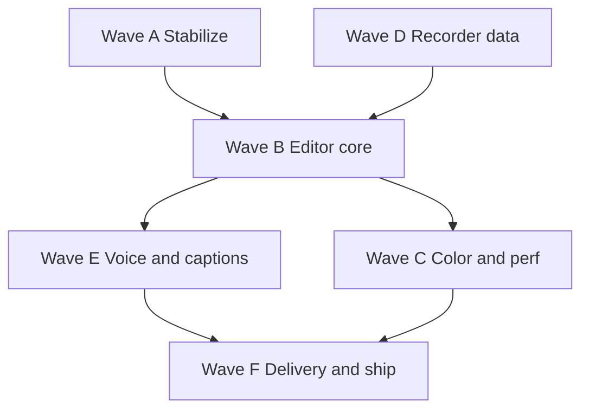

# Pending improvements — phased plan

Status: **living roadmap** (2026-10-06). QA-style inventory of open work plus
Waves **A–F** for execution order. Complements [SUMMARY.md](SUMMARY.md),
[FULL_GAP_AUDIT.md](FULL_GAP_AUDIT.md), and [MASTER_PHASE_PLAN.md](MASTER_PHASE_PLAN.md).

**Legend:** ⬜ not started · 🟡 partial · ✅ done

---

## What to do next (immediate — Wave A, ~1–2 weeks)

| Order | Deliverable | Why now |
|---|---|---|
| 1 | Finish **QA regression** on recent editor work | Prevents rework on keyframes/export/timeline |
| 2 | Add tests: compositor crop/rotation golden; speed `sourceTimeAt`; export quality presets | Closes test gaps |
| 3 | Fix **doc drift** (Animated `value`, snapping, MKV in audit) | Keeps team aligned |
| 4 | Pick **Wave B.1** (speed UI) OR **Wave D.1** (cursor events) based on product bet | Both are high user value; speed is faster to ship |

---

## Master inventory — all pending by domain

### A. Recorder → editor import (FULL_GAP_AUDIT §16)

| Item | Status | Phase |
|---|---|---|
| Window / region capture | 🟡 | Wave D |
| Cursor as restylable data | ⬜ | Wave D |
| Click / keystroke events | ⬜ | Wave D |
| Pause / resume while recording | ⬜ | Wave D |
| Live mic noise suppression | ⬜ | Wave E |
| Retake / segment takes | ⬜ | Wave F+ |
| Phone camera live QA | 🟡 | Wave A |
| Instant upload after record | ⬜ | Wave F |

### B. Project archive & media (§1, §9.6)

| Item | Status | Phase |
|---|---|---|
| **Archive project** (folder + copied media) | ⬜ | Wave F |
| Relink offline media | ⬜ | Wave F |
| Proxy generation + toggle | ⬜ | Wave C |
| Media browser / bins | ⬜ | Wave F+ |
| Consolidate / transcode unused | 🟡 | Wave F |

### C. Pack store / CDN ([FEATURE_DELIVERY.md](FEATURE_DELIVERY.md))

| Item | Status | Phase |
|---|---|---|
| `src/packs/` PackStore + verifier | ⬜ | Wave E |
| PackDownloader + QML prompt | ⬜ | Wave E |
| Project `packs` map + missing badge | ⬜ | Wave E |
| First pack: Whisper transcription | ⬜ | Wave E |
| Look/template/stock packs | ⬜ | Wave F+ |
| Voice cleanup model (built-in per design) | ⬜ | Wave E |

### D. Timeline editing (§2)

| Item | Status | Phase |
|---|---|---|
| Split, trim, linked groups, silence removal | ✅ | — |
| Track-only delete (`deleteClipLocal`) | ✅ | — |
| Track height, grid modes | ✅ | — |
| Ripple / roll / slip / slide | ⬜ | Wave B |
| Insert / overwrite / replace edits | ⬜ | Wave B |
| Copy/paste clips, paste attributes | ⬜ | Wave B |
| Gap close / detect gaps | ⬜ | Wave B |
| Connected clips (overlays follow segment) | ⬜ | Wave B |
| Multicam angles | ⬜ | Wave F+ |
| Nested timelines | ⬜ | Wave F+ |
| Text-based edit (transcript) | ⬜ | Wave E |
| Undo history list | 🟡 | Wave F+ |

### E. Speed & time (§2.22, ROADMAP 2.6)

| Item | Engine | UI | Phase |
|---|---|---|---|
| Constant speed (`Clip::speed`) | ✅ | ⬜ | **Wave B.1** |
| Reverse | ⬜ | ⬜ | Wave B.1 |
| Freeze frame | ⬜ | ⬜ | Wave B.1 |
| Audio on speed change (pitch / mute) | ⬜ | ⬜ | Wave B.2 |
| Speed ramps / curves | ⬜ | ⬜ | Wave C |
| Optical-flow blend (pack) | ⬜ | ⬜ | Wave F+ |

### F. Transform keyframes (recent partial ship)

| Item | Status | Phase |
|---|---|---|
| API + Effects panel (`KeyframesSection`) | ✅ | — |
| Crop + rotation in compositor | ✅ | — |
| Timeline key diamonds + scrub | ⬜ | Wave B.2 |
| Style/Overlay/canvas → `setClipKeyframe` | ⬜ | Wave B.2 |
| `rebuildSelection` at playhead | ⬜ | Wave B.2 |
| Shortcuts ⌥K, prev/next key | ⬜ | Wave B.2 |
| Anchor for screen/camera layers | 🟡 | Wave B.2 |
| Graph editor / easing UI | ⬜ | Wave C |

### G. Color (SUMMARY §7, ROADMAP Phase 1)

| Item | Status | Phase |
|---|---|---|
| GPU renderer + Color page (wheels, scopes, curves, qualifier, looks) | 🟡/✅ | — |
| Input HDR tone map (1.2 partial) | 🟡 | Wave C |
| Float linear + ACES / OCIO output | ⬜ | Wave C |
| **Grade keyframes** on Color page | ⬜ | **Wave C.1** |
| HSL curves | ⬜ | Wave C.1 |
| Sharpen + noise reduction | ⬜ | Wave C.1 |
| Window tracking | ⬜ | Wave C |
| Decode → GPU texture (export perf) | ⬜ | **Wave C.2** |

### H. Audio (§3)

| Item | Status | Phase |
|---|---|---|
| Clip gain, fades, basic mixer | 🟡 | — |
| Crossfades | ⬜ | Wave B |
| Volume keyframes / rubber band | ⬜ | Wave B |
| EQ, compressor, limiter, de-esser | ⬜ | Wave E |
| Loudness LUFS + normalize | ⬜ | Wave E |
| Auto-duck music | ⬜ | Wave E |
| Voice-over punch-in record | ⬜ | Wave D |
| “Clean up voice” one-click chain | ⬜ | Wave E |

### I. Export & delivery (§5)

| Item | Status | Phase |
|---|---|---|
| MP4/MKV/MOV H.264 + quality/bitrate | 🟡 | Wave A verify |
| HEVC, ProRes, GIF, WebM | ⬜ | Wave F |
| Export in/out / selected only | ⬜ | Wave F |
| Platform presets (Shorts, TikTok…) | 🟡 | Wave F |
| Chapters from markers | ⬜ | Wave F |
| Share link + comments | ⬜ | Wave F |
| Render queue (multi jobs) | 🟡 | Wave F+ |
| User-saved export presets | ⬜ | Wave F |

### J. Captions & AI (§6–7)

| Item | Status | Phase |
|---|---|---|
| Subtitle track, SRT/VTT import/export | ✅ | — |
| Auto transcription | ⬜ | Wave E |
| Animated / karaoke captions | ⬜ | Wave E |
| Filler-word removal | ⬜ | Wave E |
| Auto reframe vertical | ⬜ | Wave D/C |

### K. Motion / recorder UX (§4)

| Item | Status | Phase |
|---|---|---|
| Auto zoom on clicks (Screen Studio) | ⬜ | Wave D |
| Cursor effects (smooth, highlight, ripple) | ⬜ | Wave D |
| Callouts, arrows, spotlight | ⬜ | Wave C |
| Transitions library | ⬜ | Wave C (ROADMAP 2.7) |
| Device frames | ⬜ | Wave F+ |

### L. Pro UI ([PRO_INTERFACE_PARITY.md](PRO_INTERFACE_PARITY.md))

| Item | Status | Phase |
|---|---|---|
| Effect Controls + stopwatch parity | ⬜ | Wave B/C |
| Command palette, menu bar workspace | ⬜ | Wave F+ |
| ~249 new icons | ⬜ | Ongoing by wave |
| Keyboard map customization | ⬜ | Wave F+ |

### M. MCP / AI assistant (SUMMARY §3)

| Item | Status | Phase |
|---|---|---|
| MCP server core (2.1–2.2 partial) | 🟡 | Wave E+ |
| Tool per new feature rule | ⬜ | Each wave adds tools |
| Edit plans, agent vision, recipes | ⬜ | Wave F+ |

### N. Performance ([PERFORMANCE.md](../PERFORMANCE.md))

| Item | Before | After (measured) | Still pending |
|---|---|---|---|
| Recording CPU | target <10% | ~14% (OK) | — |
| Export 20s 1080p30 | 11.8s wall | 10.3s wall (−35% CPU) | GPU path, decode-to-GPU |
| Timeline drag <8ms | target | unmeasured | Profile in Wave A |
| Playback proxies | — | — | Wave C |

### O. Ship & platform (§18)

| Item | Status | Phase |
|---|---|---|
| macOS notarization / hardened runtime | ⬜ | Wave F |
| Windows installer + real HW test | ⬜ | Wave F |
| Auto-update | ⬜ | Wave F |
| Codec licensing (LGPL FFmpeg ship) | ⬜ | Wave F |
| Telemetry opt-in | ⬜ | Wave F |

---

## Phased strategic plan (Waves A → F)

Aligned with **MASTER Stage 0–7** “Wave 1 = all **a** phases (P0/P1)” — compressed into shippable product waves.

| Wave | Theme | MASTER stages | Size est. | Exit criteria |
|---|---|---|---|---|
| **A** | Stabilize & measure | 0 QA, 4 partial | **S** 1–2 wk | Regression green; perf baseline logged; docs synced |
| **B** | Editor core parity | Stage 4a partial | **M** 3–4 wk | Speed UI; keyframes v2; copy/paste; ripple delete v1 |
| **C** | Color + performance | Stage 1 remainder | **M–L** 4–8 wk | Grade keyframes; HSL/NR/sharpen; export GPU decode path |
| **D** | Recorder differentiation | Stage 0.3a | **M** 3–4 wk | Cursor/click in manifest; auto-zoom MVP |
| **E** | Voice, captions, packs | Stage 4 + 0 AI | **L** 5–8 wk | Transcribe + text edit; PackManager; voice cleanup v1 |
| **F** | Delivery & ship | Stage 6–7 + 0.1a | **L** 5–8 wk | Archive project; HEVC; share link; signed installers |

**Parallel option:** Start **Wave D.1** (cursor events) alongside **Wave B.1** (speed UI) — different areas (`capture/` vs `ui/`).

---

## Wave breakdown (actionable steps)

### Wave A — Stabilize (do first)

| Step | Work | Files / tests |
|---|---|---|
| A.1 | Manual QA: linked delete, grid, MKV/MOV export, keyframes scrub | Editor smoke checklist |
| A.2 | Automated: rotation/crop compositor test; export preset regression | `tests/editor/`, `Export.*` |
| A.3 | Re-run export benchmark → update PERFORMANCE.md §10 | `lectern-export`, Release build |
| A.4 | Doc fixes: TIMELINE_ENGINE, FULL_GAP_AUDIT §5 | `docs/` |

### Wave B — Editor core

| Step | Work | Depends |
|---|---|---|
| B.1 | **Speed UI:** 0.25×–4×, reverse, freeze at playhead; `EditOpsTest` | Engine `speed` ✅ |
| B.2 | **Keyframes v2:** timeline markers; canvas/Style/Overlay keyframe mode; selection at playhead | `ProjectClipKeyframes`, QML |
| B.3 | Copy/paste clip + paste attributes | `EditOps`, clipboard |
| B.4 | Ripple trim tools (ripple delete exists; roll/slip lite) | Timeline UI |
| B.5 | Volume rubber band (reuse `Animated` on clip audio) | Timeline + Audio panel |
| B.6 | Crossfades on audio | `AudioMixer` |

### Wave C — Color & perf

| Step | Work | Depends |
|---|---|---|
| C.1 | Grade keyframes on Color page + MCP `set_grade_keyframe` | ROADMAP 1.14 |
| C.1b | HSL curves, sharpen, NR | SUMMARY next |
| C.2 | GPU decode → texture; drop swscale hot path | ROADMAP 1.1 next |
| C.3 | Proxies + playback resolution half/quarter | AUDIT §1.7, §10.2 |
| C.4 | Basic transitions (dissolve, slide) | ROADMAP 2.7 lite |

### Wave D — Recorder data → editor magic

| Step | Work | Depends |
|---|---|---|
| D.1 | Extend session manifest: cursor path, clicks, keys (time + coords) | `capture/`, RECORDING_ENGINE |
| D.2 | Importer attaches events to project or screen clip metadata | `RecordingImporter` |
| D.3 | Auto-zoom effect driven by events (keyframes or effect params) | Effects + keyframes |
| D.4 | Cursor highlight / smooth (post) | §4.14 |
| D.5 | Pause/resume recording + timeline markers | Capture + UI |

### Wave E — Voice, captions, packs

| Step | Work | Depends |
|---|---|---|
| E.1 | `src/packs/` store + signed catalog test server | FEATURE_DELIVERY §10 |
| E.2 | Transcription pack + Subtitles panel “Transcribe” | AUDIT §6.3 P0 |
| E.3 | Text-based editing (delete words → ripple) | §2.18 |
| E.4 | Built-in voice cleanup chain (small model) | §3.23 |
| E.5 | Filler removal, animated captions v1 | §6.6 |
| E.6 | MCP tools for each new action | ROADMAP rule |

### Wave F — Delivery, archive, ship

| Step | Work | Depends |
|---|---|---|
| F.1 | **Archive project** UI + bundle format + open relink | §9.6 |
| F.2 | Export HEVC; in/out range; saved presets | §5 |
| F.3 | Share link MVP (password, expiry) | §5.19 |
| F.4 | Chapters from markers in MP4 | §5.11 |
| F.5 | Signing, notarization, Windows HW pass, auto-update | §18 |
| F.6 | Collect project includes used pack assets | FEATURE_DELIVERY §7 |

---

## Mapping: v2 MASTER stages → waves

| MASTER stage | Wave(s) | Notes |
|---|---|---|
| 0.1 Ship product | F | Signing, installer, codec |
| 0.2 Privacy / redaction | F+ | After share link |
| 0.3 Recorder must-haves | D, E | Cursor + voice |
| 1 Color (ROADMAP P1) | C | Grade keys, HSL, tracking later |
| 2 MCP + agent | E, F+ | Tool per feature |
| 3 Effects / motion | C, D | Transitions, zoom |
| 4 Editing + audio | B, E | Speed, ripple, transcription |
| 5 Pro UI | B, F+ | Keyframes UI, palette later |
| 6 Delivery | F | Export++, share |
| 7 Platform / perf | A, C, F | GPU, Windows |
| 8 Specialist P3 | Backlog | Fusion, VST, Linux |

---

## Sprint recommendation (next 4 weeks)

| Week | Focus | Outcomes |
|---|---|---|
| 1 | Wave A complete | Green tests, benchmark logged |
| 2 | Wave B.1 + B.2 start | Speed UI shipped; timeline key markers WIP |
| 3 | Wave B.2 finish + B.3 | Keyframes usable end-to-end; copy/paste |
| 4 | Wave C.1 OR Wave D.1 | Either grade keyframes **or** cursor manifest (pick one product priority) |

---

## Executive summary (tester snapshot)

| Area | Verdict | Notes |
|---|---|---|
| Core recorder → editor | **Done** | `src/services/RecordingImporter.cpp` |
| Timeline editing | **Partial** | `deleteClipLocal`, grid/height ✅ |
| Transform keyframes | **Partial** | `KeyframesSection.qml` |
| Clip speed | **Pending UI** | `Clip::speed` in timeline model |
| Color workspace | **Partial** | Grade keyframes pending |
| Export | **Partial** | MP4/MKV/MOV + bitrate |
| Packs / archive | **Pending** | Design only |
| MCP | **Partial** | Not full tool set |
| Performance | **Risk** | CPU export; GPU partial |

### Performance (before / after)

| Metric | Before | After |
|---|---|---|
| Export 20s 1080p30 | 11.8s wall / 12.0s CPU | 10.3s / 7.8s CPU |
| Recording sync 1h | — | 0.27 ms worst offset |

### Done vs pending (one line)

| Workstream | Done | Partial | Pending |
|---|---|---|---|
| Record → editor | tracks, recovery | phone | cursor/click |
| Timeline | split, silence | linked, grid | ripple, speed UI |
| Keyframes | API, Effects | anchor | timeline, shortcuts |
| Speed | model | — | UI, ramps |
| Export | H.264, containers | quality | HEVC, in/out |
| Archive / packs | — | import copy | all |
| Ship | macOS app | — | notarize, Win |

**Default execution:** **Wave A**, then **Wave B**, unless product prioritizes **Wave D** (recorder events) for Screen Studio–style parity.

---

## Import / archive / pack paths (recap)

| Path | Status |
|---|---|
| **Recorder → editor** (session manifest → project) | ✅ tracks; ⬜ cursor/click data |
| **Archive project** (bundle + media) | ⬜ Wave F |
| **Pack CDN** (transcription, looks, templates) | ⬜ design in FEATURE_DELIVERY; ⬜ code Wave E |

See [FEATURE_DELIVERY.md](FEATURE_DELIVERY.md) for pack format and [FULL_GAP_AUDIT.md](FULL_GAP_AUDIT.md) §16 for recorder gaps.
