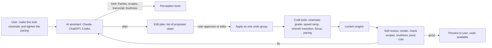
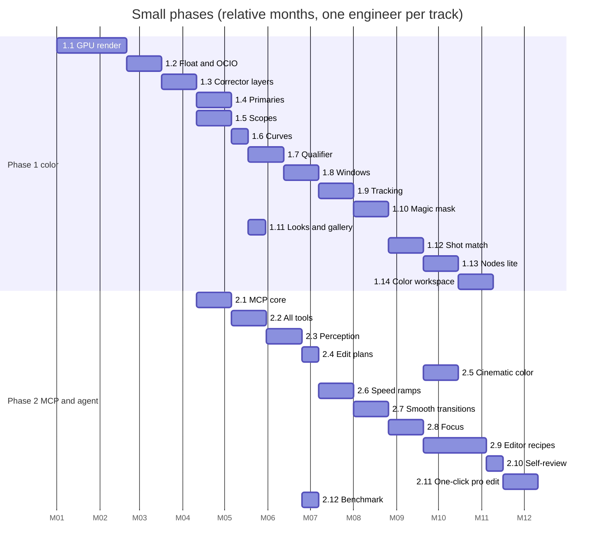

# Roadmap in Small Phases

The order of work, cut into small phases that each ship something usable
and tested. Requested 2026-10-05:

- **Phase 1 — DaVinci-style color grading**, step by step.
- **Phase 2 — deep MCP**: every feature controllable by AI assistants
  (Claude, ChatGPT, Codex), plus the "pro editor" abilities an assistant needs
  to edit like an experienced editor — cinematic color, speed ramps, smooth
  transitions, keeping focus on the subject.

Each small phase lists: goal · what ships · MCP tools it adds (every phase
is MCP-ready from the day it ships) · tests · done when · size
(**S** ≈ 1–2 weeks, **M** ≈ 3–4 weeks, **L** ≈ 5–8 weeks for one engineer;
estimates, to be refined).

Background: ARCHITECTURE_V2.md (how), DAVINCI_COLOR_PAGE.md and
COLOR_EFFECTS_PARITY.md (what), AI_ASSISTANTS_MCP.md (MCP design),
FEATURE_DELIVERY.md (packs).

---

## Overview

```mermaid
flowchart LR
    subgraph P1["Phase 1 - Color grading like DaVinci"]
        P11["1.1 GPU render"] --> P12["1.2 Float + color mgmt"] --> P13["1.3 Corrector layers"] --> P14["1.4 Primaries"] --> P15["1.5 Scopes"]
        P15 --> P16["1.6 Curves"] --> P17["1.7 Qualifier"] --> P18["1.8 Windows"] --> P19["1.9 Tracking"]
        P19 --> P110["1.10 Magic mask"] --> P111["1.11 Looks + gallery"] --> P112["1.12 Shot match"] --> P113["1.13 Nodes lite"] --> P114["1.14 Color workspace"]
    end
    subgraph P2["Phase 2 - Deep MCP and the pro-editor agent"]
        P21["2.1 MCP core"] --> P22["2.2 All tools"] --> P23["2.3 Agent can see"] --> P24["2.4 Edit plans"]
        P24 --> P25["2.5 Cinematic color"] --> P26["2.6 Speed ramps"] --> P27["2.7 Smooth transitions"] --> P28["2.8 Focus"]
        P28 --> P29["2.9 Editor recipes"] --> P210["2.10 Self-review"] --> P211["2.11 One-click pro edit"] --> P212["2.12 Quality benchmark"]
    end
    P13 -.->|"MCP core can start in parallel after 1.3"| P21
```

Phase 2 can start in parallel once Phase 1.3 lands (the data model is
stable). Steps 2.1–2.2 wrap the features that already exist today.

---

## Phase 1 — Color grading like DaVinci Resolve

### 1.1 GPU render path — **L** · ~12M Claude tokens · ✅ done 2026-10-05
- **Goal:** move rendering to the GPU without changing any picture.
- **Ships:** `render/` module on Qt RHI; everything today's CPU compositor
  draws (layouts, rounded corners, shadows, text, blur, vignette, zoom,
  current color + LUT); setting to switch; CPU path kept as fallback.
- **MCP:** none new (rendering is internal).
- **Tests:** golden images GPU vs CPU for every existing compositor test;
  frame time p95 < 12 ms at 1080p on M1.
- **Done when:** preview and export use the GPU by default with identical
  output.
- **As built (2026-10-05):** `src/render/GpuRenderer.{h,cpp}` +
  `shaders/quad.vert`, `shaders/layer.frag` (qsb at build time). Registered at
  startup through `editor::setRendererFactory`; `LECTERN_RENDERER=cpu` opts
  out; falls back to the CPU compositor if the GPU fails. Media layers, shapes
  (SDF antialiasing), borders, analytic soft shadows, vignette, color curves
  and LUTs, Gaussian blur and background blur on the GPU; text and subtitles
  rasterized with the CPU compositor's own code into cached overlays. Export
  renders straight to NV12 on the GPU and decodes the next frame ahead.
  Verified: 12 tests in `tests/render` (mean difference 0.001–0.3 / 255 per
  scene; exported video 0.03–0.04 luma levels apart); styled 1080p frame
  5.7 ms GPU vs 17 ms CPU; export 8 s of 1080p in 2.1–3.1 s. Not verified:
  Direct3D 11 on Windows (compiles only with Qt Shader Tools available).
  Next: decode straight into GPU textures (removes the 13 ms/frame
  decode+convert that now bounds export) and show the GPU texture in the
  preview without reading it back.

### 1.2 Float and color management — **M** · ~5M Claude tokens · 🟡 input color done 2026-10-06
- **Goal:** no banding, correct color for every camera.
- **Ships:** RGBA16F linear pipeline; OpenColorIO; per-clip input color
  space (auto from metadata, override in clip settings); working space;
  display and output transforms; Rec.709 / sRGB / HLG / PQ inputs.
- **MCP:** `set_clip_color_space`, `set_project_color_space`.
- **Tests:** transform round trips; gradient banding metric; HLG phone clip
  looks right on SDR export.
- **Done when:** any supported camera clip looks correct with no manual
  setting.
- **As built so far (2026-10-06):** media keep their color tags
  (`colorPrimaries`, `colorTransfer`); each clip has an input color space
  (Auto or an override, Adjust panel + MCP `set_clip_color_space`);
  HDR/wide-gamut sources decode at 10 bits (BGR30 → RGB10A2 textures) and are
  converted to the Rec.709 working space by the same math on CPU and GPU
  (`editor::convertInputColor`, `layer.frag`): sRGB/BT.1886 decode, gamut
  matrix, PQ/HLG → nits with BT.2408 reference white (203 nits) and a
  highlight roll-off. Verified by 6 unit tests, a GPU-vs-CPU test for P3,
  HLG and PQ, and an end-to-end 10-bit HLG FFV1 file (probe → 10-bit decode →
  same result on both renderers, within 4 levels of the reference).
- **Still to do for 1.2:** RGBA16F canvas with linear-light blending,
  OpenColorIO / ACES working spaces, display and HDR output transforms.

### 1.3 Corrector layers (project format v3) — **M** · ~5M Claude tokens
- **Goal:** several corrections per clip, like Resolve's serial nodes.
- **Ships:** `Corrector[]` per clip + timeline grade; enable, label,
  reorder, copy/paste grade; v2 → v3 migration.
- **MCP:** `add_corrector`, `remove_corrector`, `copy_grade`, `paste_grade`.
- **Tests:** migration renders identically; undo/redo of every corrector op.
- **Done when:** old projects open unchanged and new ones can stack grades.

### 1.4 Primaries palette (Resolve layout) — **M** · ~5M Claude tokens
- **Goal:** the Color Wheels palette from the Resolve screenshot.
- **Ships:** Lift / Gamma / Gain / Offset wheels with Y R G B fields and
  master jog wheels; Temp, Tint, Contrast, Pivot, Mid/Detail; Color Boost,
  Shadows, Highlights, Saturation, Hue, Lum Mix; Auto Balance and
  white-balance picker; scrubby number fields; Primaries Bars and Log
  Wheels modes. Same defaults and ranges as Resolve (DAVINCI_COLOR_PAGE §5).
- **MCP:** `set_primaries` (any subset of the fields), `auto_balance`.
- **Tests:** chart tests (known input → expected output values); QML tests
  dragging a wheel puck and scrubbing a field.
- **Done when:** a colorist can do a full primary grade without leaving the
  palette.

### 1.5 Scopes — **M** · ~5M Claude tokens
- **Goal:** grade by numbers.
- **Ships:** waveform, RGB parade, vectorscope (skin-tone line), histogram;
  10-bit and % scales; GPU compute from the graded frame; 1/2/4-up.
- **MCP:** `get_scopes` (returns numeric summaries: black/white levels per
  channel, average saturation, skin-tone hue deviation, clipping %) — the
  agent's "eyes" for color.
- **Tests:** scope data matches a CPU computation on test images.
- **Done when:** scopes update in real time during playback.

### 1.6 Curves — **S** · ~2.5M Claude tokens
- **Ships:** Custom YRGB curves (ganged/unganged, soft clip), Hue vs Hue,
  Hue vs Sat, Hue vs Lum, Lum vs Sat, Sat vs Sat; picker adds points from
  the viewer.
- **MCP:** `set_curve` (points per curve).
- **Tests:** curve math unit tests; golden images.

### 1.7 HSL qualifier — **M** · ~5M Claude tokens
- **Ships:** HSL/Luma qualifier, matte finesse (blur, clean black/white,
  denoise), invert, highlight view, picker add/subtract.
- **MCP:** `qualify` (hue/sat/lum ranges or "pick at x,y,t").
- **Tests:** matte accuracy on synthetic color patches.

### 1.8 Power windows — **M** · ~5M Claude tokens
- **Ships:** linear, circle, polygon, curve, gradient windows; softness,
  inside/outside, invert; on-viewer handles; combine with the qualifier.
- **MCP:** `add_window` (shape, rect, softness).
- **Tests:** window matte golden images; QML handle-drag tests.

### 1.9 Tracking — **M** · ~5M Claude tokens
- **Ships:** point/planar tracker driving windows (and later blur, text);
  track forward/back; keyframed results editable.
- **MCP:** `track_window` (window id, range).
- **Tests:** synthetic moving-target accuracy (< 1 px drift over 10 s).

### 1.10 Magic mask (AI) — **M** · ~5M Claude tokens
- **Ships:** person/object mask with add/subtract strokes, tracked through
  the clip (Vision on macOS, ONNX model pack on Windows); used as a window.
- **MCP:** `mask_subject` (person / face / object at point).
- **Tests:** IoU against hand-made masks on a small test set.

### 1.11 Looks, LUTs and gallery — **S** · ~2.5M Claude tokens
- **Ships:** looks gallery with thumbnails; grab still, wipe compare,
  apply grade from still; LUT before/after grade; export grade as .cube;
  more camera log conversions.
- **MCP:** `list_looks`, `apply_look` (with strength), `grab_still`.

### 1.12 Shot match and auto color — **M** · ~5M Claude tokens
- **Ships:** match a clip to a reference clip/still (screen ↔ camera,
  camera A ↔ camera B); improved auto balance using scopes.
- **MCP:** `match_shot` (clip → reference).
- **Tests:** ΔE between matched clips below a threshold on test pairs.

### 1.13 Nodes lite — **M** · ~5M Claude tokens
- **Ships:** node view of correctors: serial, parallel, layer mixer,
  outside node; node labels; shared correctors across clips (group grade).
- **MCP:** `add_node` (type, after), `connect_nodes`.
- **Tests:** graph evaluation equals the equivalent serial stack where it
  should.

### 1.14 Color workspace — **M** · ~5M Claude tokens
- **Ships:** Color mode layout (gallery, viewer, nodes, clip strip,
  palette bar, scopes, keyframes); keyframed grades; shortcuts from
  SHORTCUTS.md B.6.
- **MCP:** `set_grade_keyframe`.
- **Done when:** the Color workspace covers DAVINCI_COLOR_PAGE §1–6 at P0/P1.

**Phase 1 total:** about 9–12 months for one engineer, less with two in
parallel (1.5 scopes and 1.6 curves can run beside 1.4).

---

## Phase 2 — Deep MCP and the pro-editor agent

The aim is not just "an API": the assistant should edit like an editor
with ten years of experience. That needs three things:
1. **Hands** — every feature reachable as an MCP tool (2.1–2.2).
2. **Eyes and ears** — the assistant can look at frames, scopes, audio
   levels and the transcript, so it can judge its own work (2.3, 2.10).
3. **Craft** — high-level tools that encode professional technique
   (cinematic grade, speed ramp, smooth transition, focus, pacing), so the
   model chooses *what* to do and Lectern does it *well* (2.5–2.9).

### 2.1 MCP core — **M** · ~5M Claude tokens · ✅ done 2026-10-06
- **Ships:** `src/mcp/` (JSON-RPC 2.0, tools/resources/prompts, progress,
  cancellation), app endpoint on localhost with token, `lectern-mcp` stdio
  bridge, headless mode, consent settings and activity chip
  (AI_ASSISTANTS_MCP.md §2, §5).
- **Tests:** MCP Inspector run; stdio and HTTP integration tests.
- **Done when:** Claude Desktop, Claude Code and Codex list Lectern's tools.
- **As built (2026-10-05/06, written in a parallel Codex session, finished
  and verified here):** `src/mcp/Server` (JSON-RPC, protocol 2025-11-25,
  schema validation, per-session access levels, progress/cancellation),
  `src/ui/McpController` (localhost HTTP with a 64-char token, owner-only
  connection file, per-client approval, activity log, undo-per-assistant),
  `tools/lectern-mcp` (stdio bridge; `--project DIR [--allow-edits]` runs
  headless), `AssistantsDialog.qml`. Verified: 5 server tests, 5 UI tests,
  and a stdio session (initialize → 33 tools → split_at, add_text →
  saved to project.json).

### 2.2 All existing features as tools — **M** · ~5M Claude tokens · ✅ done 2026-10-06
- **Ships:** the ~35 tools of AI_ASSISTANTS_MCP §3 (timeline, text,
  captions, layout, color, effects, audio, export jobs, layers) plus every
  Phase 1 tool; JSON Schemas; annotations (read-only / destructive);
  "Assistant: …" undo labels; undo-all-assistant-edits.
- **Rule from here on:** *no feature ships without its MCP tool and a test
  that calls it.*
- **As built (2026-10-06):** 40 tools in the app (38 headless): the 33 from
  2.1 plus `render_frame` (PNG through the preview's renderer, GPU when
  available), `export_video` / `get_export` / `cancel_export` (background
  job, files only in the project's `Exports` folder, full access needed),
  `import_subtitles` / `export_subtitles` (project folder only), and in the
  app `list_projects` / `open_project` (recent projects only). Tested in
  `tests/ui/McpTest.cpp` (9 tests).
- **Tests:** one controller test per tool; schema rejects bad input.

### 2.3 Perception — the agent can see and hear — **M** · ~5M Claude tokens
- **Ships:**
  - `render_frame` / `render_contact_sheet` (grid of frames across a range)
  - `get_scopes` (from 1.5), `get_loudness` (LUFS, peaks per clip/track)
  - `get_transcript` with word timings, speaker turns, filler words
  - `analyze_shots`: shot boundaries, motion amount, faces/subject boxes,
    brightness/contrast stats, blur/shake score
  - `analyze_audio`: speech/music/silence segments, noise floor
- **Tests:** analysis outputs on reference clips within tolerances.
- **Done when:** an assistant can describe a project accurately without
  the user explaining it.

### 2.4 Edit plans (propose → preview → apply) — **S** · ~2.5M Claude tokens
- **Ships:** `propose_edit_plan` (the agent submits steps; Lectern validates
  them and shows a reviewable list with a preview), `apply_edit_plan` (one
  undo group), `discard_edit_plan`; plan panel in the UI with per-step
  checkboxes.
- **Why:** big automatic edits stay safe and understandable.
- **Tests:** plans with invalid steps are rejected with clear errors;
  apply/undo round trip.

### 2.5 Cinematic color (craft tool) — **M** · ~5M Claude tokens
- **Ships:** `cinematic_grade` with styles (natural film, teal & orange,
  warm documentary, cool tech, moody low-key, high-key commercial,
  black & white) and strength. Built from Phase 1 tools as a proper node
  tree: normalize exposure/white balance from scopes → contrast S-curve
  with protected skin tones (qualifier) → look (split-tone, LUT) →
  optional film grain, halation, vignette → final legal-range check.
  Auto-matches all camera clips first (1.12).
- **MCP:** `cinematic_grade`, `explain_grade` (describes each node, so the
  user learns what was done).
- **Tests:** scope-based checks (no clipping, skin-tone hue within the
  skin line ± 10°, consistent across shots); golden images per style.

### 2.6 Speed ramps — **M** · ~5M Claude tokens
- **Ships:** time remapping with speed curves (ease in/out, bezier),
  presets (ramp up, ramp down, "hero" slow-down at a moment, montage
  speed-up), frame blending now and optical-flow interpolation later
  (model pack); audio follows (pitch-preserving stretch or muted).
- **MCP:** `speed_ramp` (clip, keyframes or preset, around time t),
  `set_speed` (constant), `freeze_frame`.
- **Tests:** timeline maths (durations, source times) unit tests; smooth
  motion metric (no duplicated-frame stutter at constant output speed).

### 2.7 Smooth transitions — **M** · ~5M Claude tokens
- **Ships:** transition library rendered on the GPU: cross dissolve, dip,
  whip pan (motion-blurred push), zoom-through, smooth cut / morph cut for
  talking-head jump cuts, light leak, blur, slide, layout transitions
  (animated change of screen/camera layout), all with easing curves;
  handles checked (enough media on both sides).
- **MCP:** `add_transition` (edit point, type, duration, easing),
  `smooth_jump_cuts` (applies smooth cut or a punch-in alternation to every
  cut inside a talking-head segment).
- **Tests:** golden frames at 25/50/75 % of each transition; edit ops keep
  transitions valid after split/trim/ripple.

### 2.8 Focus — keep attention on the subject — **M** · ~5M Claude tokens
- **Ships:**
  - **Auto punch-in**: alternate wide / close framing on cuts to hide jump
    cuts and add energy (talking heads).
  - **Follow the cursor / clicks** on screen recordings (auto zoom with
    smooth easing; needs cursor/click data, FULL_GAP_AUDIT §16.4–16.5).
  - **Subject reframe** for 9:16 / 1:1 using the subject boxes from 2.3.
  - **Cinematic focus**: background blur / depth-of-field look behind the
    person (segmentation mask), "rack focus" between foreground and
    background over time.
- **MCP:** `auto_zoom` (follow cursor / clicks, intensity),
  `punch_in_on_cuts`, `reframe` (aspect, subject), `focus_blur` (amount,
  keyframes).
- **Tests:** zoom paths stay inside the frame and ease smoothly
  (acceleration limits); reframe keeps the subject box inside the crop
  ≥ 95 % of frames.

### 2.9 Editor recipes (ten years of craft as tools and prompts) — **L** · ~12M Claude tokens
- **Ships:** high-level tools that combine the pieces the way experienced
  editors do, each with parameters the agent can tune:
  - `tighten_pacing` — remove pauses and filler words with natural
    breathing room; J-cuts/L-cuts so audio leads picture.
  - `hook_first` — find the strongest line (transcript + energy) and move a
    short teaser to the start.
  - `add_b_roll` — place overlay clips/screens over talking sections at
    sentence boundaries.
  - `music_bed` — add music, auto-duck under speech, cut to the end of a
    musical phrase.
  - `chapters_and_titles` — markers, chapter titles, lower thirds from the
    transcript.
  - `captions_styled` — captions with word highlight in a chosen style.
  - `polish_audio` — clean voice, EQ, compression, loudness to −14 LUFS.
  - `make_shorts` — 30–60 s vertical clips with hook, captions, reframe.
  - MCP **prompts** for whole workflows: "YouTube tutorial", "product demo",
    "podcast clip", "course lesson".
- **Tests:** each recipe on reference projects: output duration ranges,
  loudness target met, no cut inside a word, captions aligned within
  100 ms.

### 2.10 Self-review loop — **S** · ~2.5M Claude tokens
- **Ships:** `review_edit` returns a checklist the agent must address:
  black/flash frames, jump cuts without transition, clipped highlights,
  skin tone off, loudness off target, captions overlapping titles, text
  outside safe area, audio gaps, abrupt music end.
- **Tests:** seeded faulty projects → each fault detected.
- **Done when:** the agent can iterate "edit → review → fix" until the
  checklist is clean.

### 2.11 One-click "Pro edit" inside Lectern — **M** (optional) · ~5M Claude tokens
- **Ships:** an in-app assistant panel using the provider the user chooses
  (Claude, OpenAI, or local model) that runs the same tools and recipes:
  "Make it cinematic", "Tighten and caption", "Make 3 shorts". Shows the
  edit plan (2.4) before applying.
- **Tests:** end-to-end on reference projects with a recorded model
  response (no network in CI).

### 2.12 Quality benchmark — **S** (continuous) · ~2.5M Claude tokens
- **Ships:** a set of 20 reference recordings (tutorial, talking head,
  demo, podcast) with target edits by human editors; scores: time saved,
  review-checklist faults, loudness/color metrics, human rating.
- **Done when:** every release reports the benchmark; regressions block
  release.

**Phase 2 total:** about 9–12 months for one engineer; 2.1–2.4 (≈ 3 months)
deliver the useful core early.

---

## Claude token estimate per step

Rough budget for building each step with Claude Code (implement, compile,
test, fix), counted as tokens processed — input, mostly re-read project
context billed at the lower cached rate, plus output (≈ 5 % of the total).
By size: **S ≈ 2.5M · M ≈ 5M · L ≈ 12M**; treat each as ×0.5–×2.

| | Steps | Tokens processed (est.) | Output (≈ 5 %) |
|---|---|---|---|
| Phase 1 — color | 14 | ~72M | ~3.6M |
| Phase 2 — MCP and agent | 12 | ~59.5M | ~3.0M |
| **Both** | 26 | **~131.5M** (≈ 65.75M–263M) | ~6.6M |

These cover the core steps above. MASTER_PHASE_PLAN.md estimates every
checklist item, including the power-user (**b**) parts and Stages 0 and 3–8,
so its totals are larger.

---

## Timeline view

Dates are placeholders (month 1 = start) to show order and overlap.

---

## Rules for every small phase

1. Ships behind nothing: usable by the user when merged (or behind a
   setting if incomplete).
2. Has its MCP tool(s) and a test that calls them.
3. Has golden-image, unit and QML interaction tests as relevant.
4. Every edit is undoable and saved like today.
5. Meets the performance budget (ARCHITECTURE_V2 §1) on an M1 8 GB.
6. Updates the matching rows in the v2 checklists (⬜ → 🟡 → ✅).
